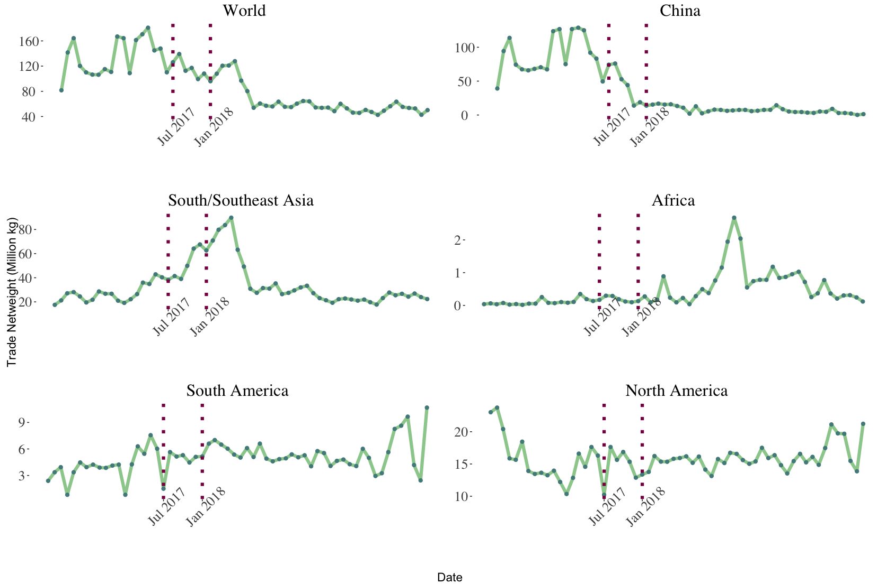
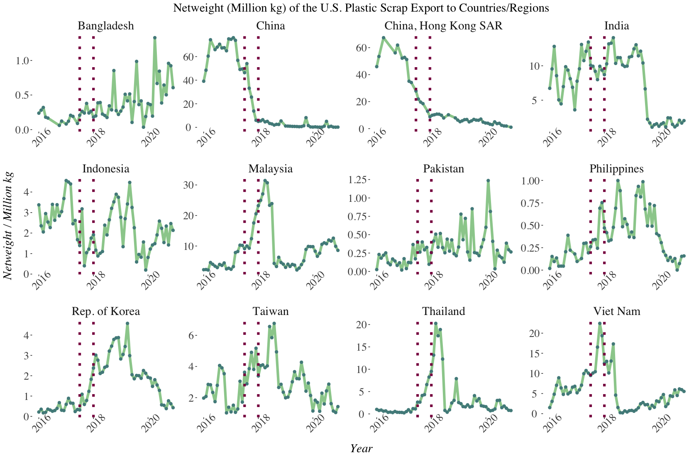
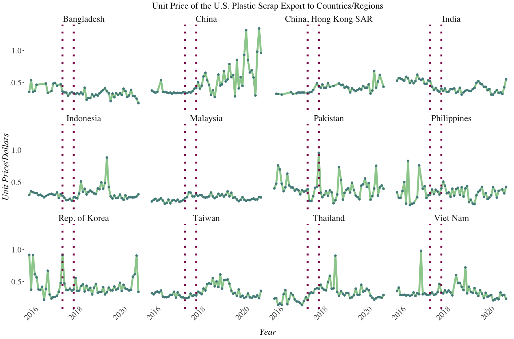
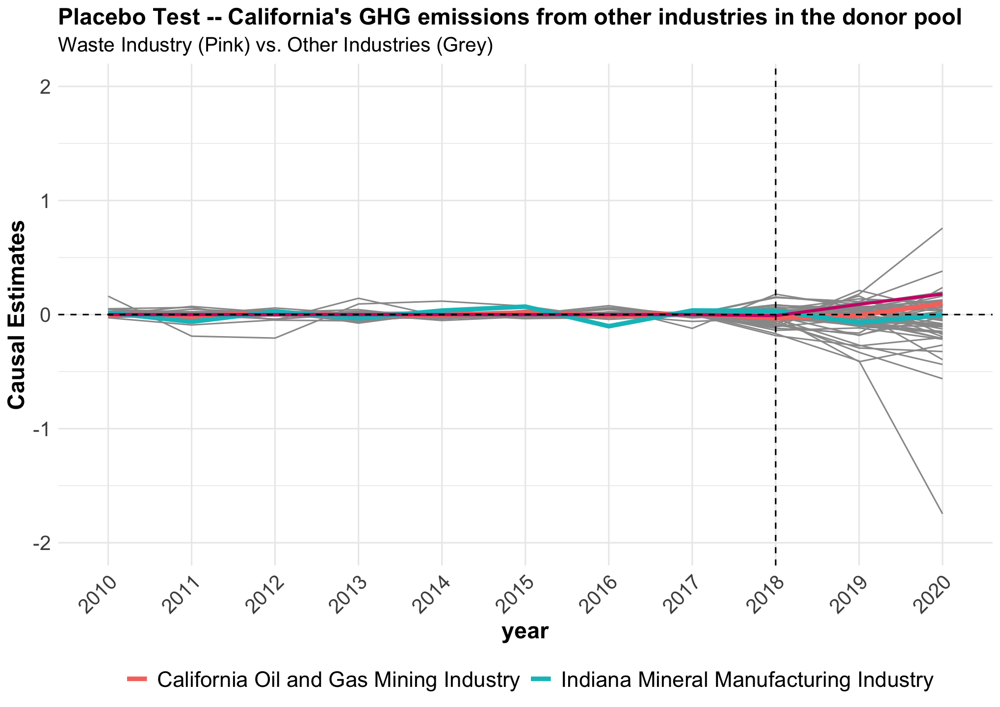
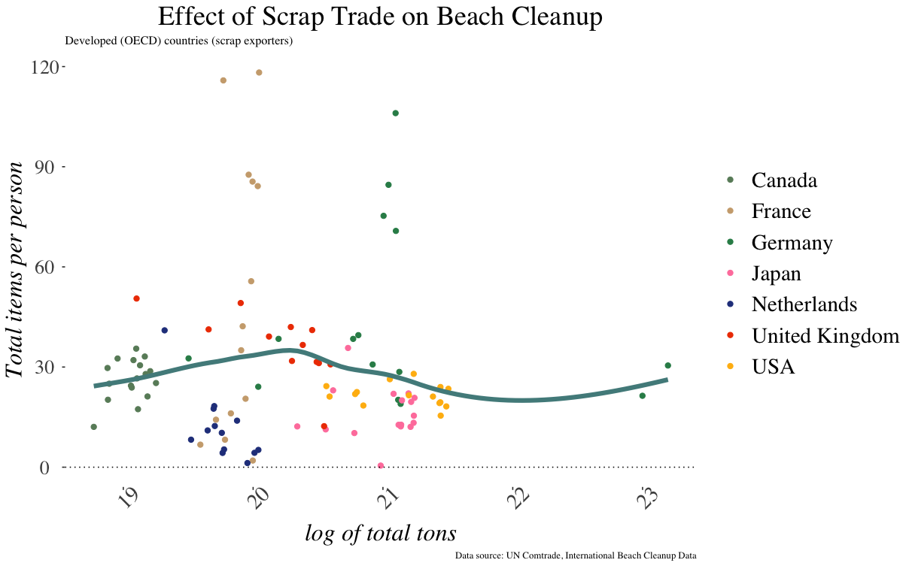
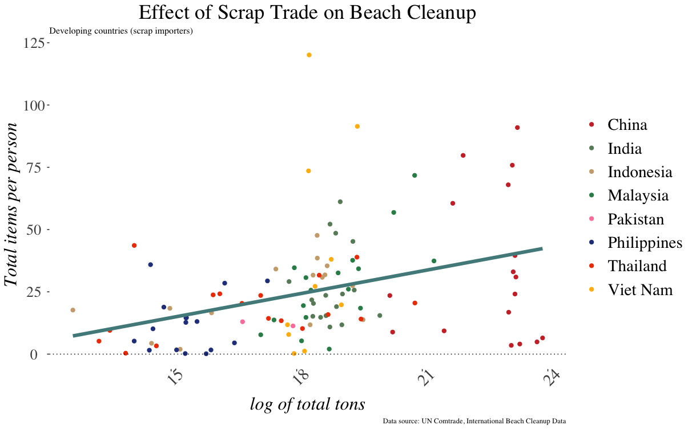
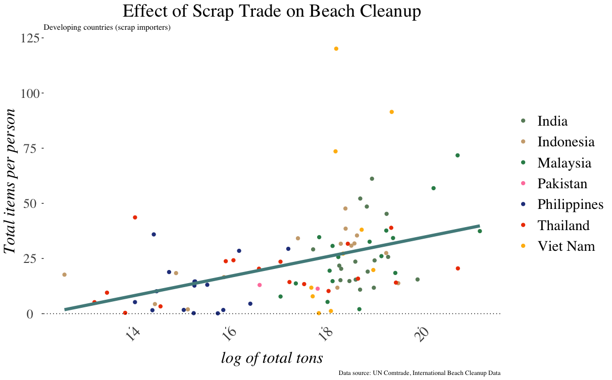
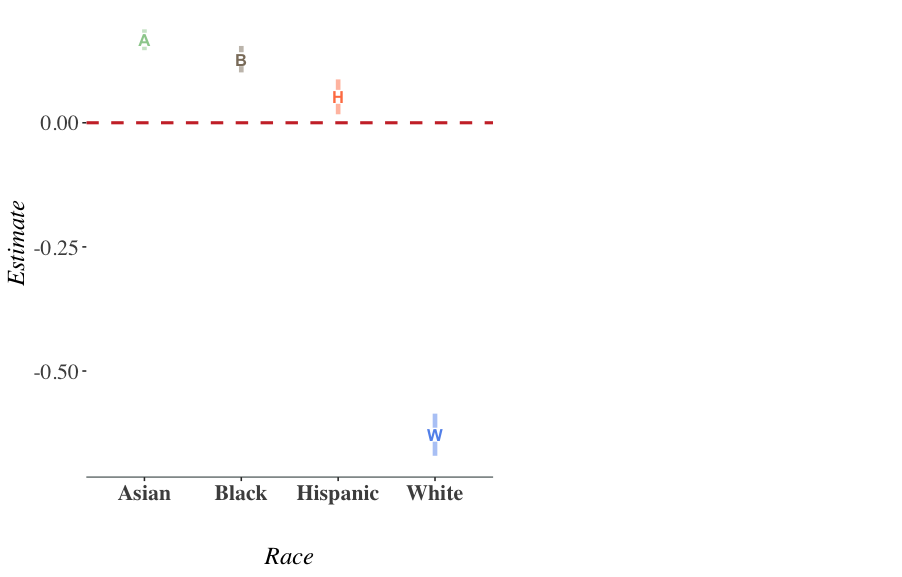

## Chapter 1

.center[
 
 
 
 
 
 

**Introduction**
]

---

## Motivation

.pull-center[
]
.center[**Figure 1.1 News Report about Recycling**]

---

## Background

In 2015, the U.S. exported **4.5 billion** pounds of scrap plastic for "recycling", over half of which was sold to China.

--
 
 
- In 2017, **China’s Green Sword (GS) Policy** bans the importation of certain types of solid waste and tightens contamination limits for some recyclable materials.
 
 
 - Policy's effect on negative-externality export
 
 
 - **Internationally**: pollution haven transition; import control; environmental justice
 
 
 - **Domestically**: landfills and emissions; pollution relocation; environmental discrimination
 
---

## Roadmap

- **Chapter 2** The Effect of China's Waste Import Ban on International Recycling Market
 
 
--

- **Chapter 3** The Effects of China's Waste Import Ban on Pollution Relocation in the U.S. (**JMP**)
 
 
--

- **Chapter 4** The effect of China's Waste Import Ban on Coastal Cleanups (with Rebecca Taylor)
 
 
--

- **Chapter 5** Willingness to Bear the Cost of Preventative Health Policies (with Trudy Ann Cameron)
 
 
--

- **Chapter 6** Conclusion
 
 

---

## Chapter 2

.center[
 
 
 
 
 
 

**The Effect of China's Waste Import Ban on International Recycling Market**

]
---

## U.S. Plastic Scrap Export by Receiving Regions
China's Green Sword Policy
- Tightens contamination limits, **February 2013**
- Bans importation of certain scraps (plastics), announced on **July 2017**
- Bans implemented on **January 2018**

--

.pull-center[
.center[Fig 2.1 U.S. Plastic Scrap Export Value by Regions]]
---

## U.S. Plastic Scrap Export Value by Receiving Regions

.pull-center[]
.center[Fig 2.2 U.S. Plastic Scrap Export Value]
---

## U.S. Plastic Scrap Export Net Weight by Receiving Regions

.pull-center[]
.center[Fig 2.3 U.S. Plastic Scrap Export Netweight]

---

## Data

- UN Comtrade Data

 - Worldwide monthly scrap import and export by types of materials and country pairs from 2002 to 2020
 
--

- CEPII Gravity Data
 - Geographical distance, trade facilitation measures, proxies for cultural proximity, macroeconomic indicators, estimated unit price of scrap material (CIF and FOB)

--

- IMF, World Bank, FRED Data
 - Monthly exchange rate, oil price, commodity terms of trade, and manufacturing add value (%GDP)
---

## Two-way Fixed Effect Regression

$$y_{it} = \alpha+ \beta D_{it}+\gamma X_{it} + g(t) + \theta Z_{i}+\nu T_{t} + \epsilon_{it}$$
.pull-center[]
.center[Table 2.1 Policy Effect on Total U.S. Plastic Export Value (Log.U.S. Dollars) across Regions]

---

## The Effect of China's GS Policy on U.S. Plastic Scrap Export

**Two-way Fixed Effect Event Study**
 
$$y_{it} = \alpha + \sum_{d=-D, d\neq-1}^{D} 1(t-e^{i} = d) \beta_{d} + \gamma X_{it} + \theta Z_{i} + \nu T_{t} + \epsilon_{it}$$
 
-  $y_{it}$  is trade value of plastic scrap between the U.S. and region $i$ at time $t$
 
 
-  $1(t-e^{i} = d)$  is an indicator variable for whether the GS policy is $d$ periods away from being enacted
 
 
-  $X_{it}$  is a vector of socioeconomic covariates for region $i$ at time $t$
 
 
-  $Z_{i}$  and  $T_{t}$  are the region and time fixed effects
---

## Event Study Results

.pull-center[
]
.center[Fig 2.4 Event Study: U.S. Plastic Scrap Export by Receiving Sub-regions]
---

## U.S. Plastic Scrap Export Netweight to Asia

.pull-center[
]
.center[Fig 2.5 Netweight (million kg) of U.S. Plastic Scrap Export by Receiving countries/regions in Asia]
---

## To Asia: U.S. Plastic Scrap Export Unit Pirce

.pull-center[]
.center[Fig 2.6 Unit Price ($) of U.S. Plastic Scrap Export by Receiving countries/regions in Asia]
---

## Machine Learning Counterfactual Method (Burlig et al. 2017)
.pull-center[]
.center[Fig 2.7 Machine Learning (Boosting) Counterfactual Trade Value of Plastic Scraps to South/Southeast Asian Countries]

---

## Import Control Regulations and Policy Efficacy

- **Other Countries imposed similar import control regulations as China**

.pull-center[.center[]]
.center[Fig 2.8 Policy Efficacy across South/Southeast Asian Countries]
---

## Conclusion

- GS policy diverted U.S. recyclable waste exports from China to other developing and underdeveloped countries

--

 - **&darr;** plastic wastes exports to China by 90 percent 
  
  
 - **&uarr;** plastic wastes exports to South/Southeast Asia and Central/South America by 150 percent and 41 percent, respectively
  
  
 - Individual countries in Southeast Asia have seen significant **increases** in recyclable wastes imported from the U.S. 
  
  
 
--

- Other developing countries implemented similar waste import control regulations **&rarr;** Recyclable wastes circulating in the U.S.
  
  

---

## Chapter 3

.center[
 
 
 
 
 
 

**The Effects of China's Waste Import Ban on Pollution Relocation in the U.S.**

]
---

## Introduction

- Recycling rate  **7% &rarr; 32%** from 1960s to present

--

- For many years, most U.S. recyclables were exported to developing countries

--

- China was the biggest importer of U.S. recyclables

--

- In 2017, China implemented its  **Green Sword (GS) Policy** banning almost all recyclable waste imports

--

- Considerable domestic environmental costs
 - **air pollution** from re-processing of these materials
 - **landfill methane (GHG) emissions**
 - **land and water pollution**
 - **ocean disposal**

--

- U.S. has no **economical or efficient** recycling infrastructure
 - Recyclables went to landfills.
---

##GS Policy and Trade

.center[Fig 3.1 Plastic Scrap Export Volume by Countries (UN Comtrade Data)]

--

- U.S. plastic scrap exports to China dropped by  **99%**

---

##GS Policy and Trade

.center[Fig 3.1 Plastic Scrap Export Volume by Countries (UN Comtrade Data)]

- U.S. plastic scrap exports to China dropped by  **99%**

--

- U.S. plastic scrap exports to the ROW  **increased, then  decreased**  after China's GS policy
---

## Research Questions

 
 

- For the **U.S.**

 - What has been the effect of China's GS policy on  **Domestic Emissions** from landfill facilities? 

 
 

--

- For the state of **California**

 - What are the **Distributional Effects** of the GS policy on pollution relocation for local communities at census block levels? 
 - What are **Environmental Justice (EJ)** implications?

---

## Relevance

**Trade and Environment** 
*Shapiro (2016), Shapiro (2018), Shapiro (2021)*

&rarr; My innovation: study a trade policy that directly restricts externality export and explore the policy's causal effects on local emissions in the U.S.

--

**Environmental Gentrification and Environmental Justice** 
*Baden and Coursey (2002), Cameron and McConnaha (2006), Banzhaf and Walsh (2008), Depro et al. (2011), Banzhaf and Walsh (2013), Depro et al. (2015), Banzhaf et al. (2019), Ho (2020), Hernandes and Meng (2020), Shapiro and Walker (2021)*

&rarr; My innovation: examine how an exogenous intl. trade policy affects U.S. EJ problems.

--

**The efficiency of curbside recycling programs** 
*Adaland and Caplan (2006), Bohm et al. (2010), Kinnaman (2014), Kinnaman et al. (2014)* 

&rarr; My innovation: show that in the absence of an overseas market for recyclables, the U.S. recycling system is inefficient even though it has the "efficient" recycling rate.

--

**Behavioral Economics of Curbside Recycling** 
*Kurz et al.(2000), Halvorsen (2010), Ashenmiller (2009), Ashenmiller (2011), Best and Kneip (2019), Berck et al. (2020), Berck et al. (2021)*

&rarr; My innovation: use this exogenous trade policy as a tool to explore the relationship between the recycling programs and local environmental outcomes in the U.S.

---

## Environmental Outcome Measurement

.pull-left[ 

.center[Fig 3.2 GHGSat’s satellite showed methane from landfills (upper: Buenos Aires, Argentina. lower: Alberta, Canada)]
]

.pull-right[ 
- Why use  **methane** emissions?

 - They are a **proxy** for general pollution emissions
 
 - Methane is far more potent at trapping the sun’s heat than carbon emissions
 
 - Satellite data is available only from 2020
 
 - Need consistently measured emissions data from 2010 to 2020
]
---
   
## Data
- [U.S. EPA Greenhouse Gas Reporting Program (GHGRP)](https://www.epa.gov/ghgreporting)

 - Methane emissions from landfill facilities 
 - 2010 to 2020 annually 

--

- Approximately 8,000 facilities required to report emissions annually

- High compliance rates

--

- Covered industries include power plants, petroleum and natural gas systems, minerals, chemicals, pulp and paper, refineries, waste, etc.

--

- Data generation process:
 - Facilities in waste industry report the **amount of wastes accepted** annually 
 - Methane Emission is calculated through a complicated model embedded in U.S. EPA

---

## Data

- [California Department of Resources Recycling and Recovery (CalRecycle) Disposal Flow Data](https://www.calrecycle.ca.gov/DataCentral/Materials/)

 - Captures the amount of disposal transported by origin jurisdiction and destination facility
 - 2002 to 2021 quarterly
 - Contains 464 origin jurisdictions and 263 disposal facilities
 
--

- Other Data Sources

 - U.S. Trade Census 
 - EPA Enforcement and Compliance Historical data
 - Bureau and Labor and Statistics (BLS) Quarterly Employment and Wages at county level
 - U.S. Census racial mix, median income at census-block level
  
---

##Identification: Synthetic Control Method

- Rely on exogenous variation in methane emissions across **all other industries** in the EPA GHGRP

 - Power plants, petroleum and natural gas systems, minerals, chemicals, pulp and paper, refineries, etc. (**not** waste)
 
--

- Take advantage of the fact that other industries which also emit GHG were not affected by China's GS policy

--

- Use other industries(all states) as donor pool for synthetic control group

--

- Train the model using pre-policy time **2010-2017**
 - calculate state-industry pair weights to minimize prediction error
$$\hat{Y_{1t}^{N}} = \sum_{j=2}^{J+1} w_{j} Y_{1t}$$

- Predict counterfactual methane emissions in the absence of GS policy using post-policy period (**2018-2020**) 

---

## Results

.center[Fig 3.3 California Waste Industry Emission Synthetic Control]

- The difference between actual emissions and synthetic emissions is the causal effect of China's GS policy on U.S. landfill methane emissions

$$\hat{\tau_{1t}} = Y_{1t} - \hat{Y_{1t}^{N}}$$

---
 
## Placebo Tests

.pull-center[

.center[Fig 3.4 Placebo Test using "Fake" Treatment Industries]
]

---

## Placebo Tests

.pull-center[

.center[Fig 3.4 Placebo Test using "Fake" Treatment Industries]
]

---

## Placebo Tests

.pull-center[

.center[Fig 3.4 Placebo Test using "Fake" Treatment Industries]
]

---

## Results
.center[Fig 3.5 Correlations of State-level Emission Net Change]
.pull-center[

]

.pull-left[
-  **&uarr;**  **Recyclable wastes a state exported** &rarr;  **&uarr;**  increase in methane emissions.
]

---

## Results
.center[Fig 3.5 Correlations of State-level Emission Net Change]
.pull-center[

]

.pull-left[
-  **&uarr;**  **Recyclable wastes a state exported** &rarr;  **&uarr;**  increase in methane emissions.
]

.pull-right[
-  **&uarr;**  **State-level rate of "significant"  environmental violations** &rarr;  **&uarr;**  decrease in methane emissions.
]

---

## Results
.center[Fig 3.6 Correlations of State-level Causal Estimates by Political Affiliation]
.pull-center[

]

.pull-left[
-  **&uarr;**  **Recyclable wastes a state exported** &rarr;  **&uarr;**  increase in methane emissions.
]

---

## Results
.center[Fig 3.6 Correlations of State-level Causal Estimates by Political Affiliation]
.pull-center[

]

.pull-left[
-  **&uarr;**  **Recyclable wastes a state exported** &rarr;  **&uarr;**  increase in methane emissions.
]

.pull-right[
-  **&uarr;**  **State-level rate of "significant"  environmental violations** &rarr;  **&uarr;**  increase in methane emissions.
]

---

## Pollution Relocation

- How does **International Trade policy** affect **pollution relocation**? 

--

- Does pollution relocate? 
 - **Cap and Trade** - Clean Air Act requires new or expanding plants to pay incumbents in the same or neighboring counties to reduce their pollution emissions (Shapiro and Walker (2021)).
 
--
 
 - **US air pollution offset markets** - Clean Air Act allows for trading of permanent pollution emissions rights between firms within a metropolitan area (Shapiro and Walker (2020)).
 
--

 - **Externality-export strategy for air pollution** - Clean Air Act (Morehouse and Rubin (2022))

--
 
 - **Waste flow** - Not In my Backyard (NIMBY) regulations limit interstate waste flows (Ho (2020)).
 
--

 - Transition to CalRecycle Data

---

## Data Source Comparison

.pull-left[
]
.pull-right[
]

.center[Fig 3.7 Data Comparison between CalRecycle, EPA and WBJ]

---

## Pollution Relocation

.center[Fig 3.8 Average net increase in waste flows across regions after the GS policy]

---

## Pollution Relocation by Racial Composition

.pull-center[.center[]]

.center[Fig 3.9 Average net increase in waste flows across regions after the GS policy] 
---

## Pollution Relocation by Racial Composition
.pull-left[]
.pull-right[]
 
.center[
Fig 3.9 Average net increase in waste flows across regions after the GS policy
]
---

## Gravity-type Model 

$$log(Y_{ijt}) = \alpha + \beta_{1} log(Dist_{ij}) + \beta_{2} log(R_{j}) + \beta_{3} log(X_{jt})$$
$$+ \beta_{5} GS_{post} * log(R_{j}) + \beta_{6} GS_{post} * log(X_{jt})$$
$$\epsilon_{o} + \theta_{d} + \mu_{od} + \eta_{t} + \lambda_{odt}$$

-   $i$  origin jurisdiction of California;  $o$  origin county

-   $j$  area that is a 3km buffer within the destination facility;  $d$  destination county

-   $t$   year-quarter

--

- $R_{jt}$  **racial compositions of destination $j$** 

- $Y_{ijt}$  **tons of the disposal transported from $i$ to  $j$ in year quarter $t$ **

- $GS_{post}$  **dummy variable for the GS policy**

- $Dist_{ij}$ distance between origin $i$ and destination $j$ 

-  $X_{jt}$ median income, regulation of environmental stringency, and economies of scale of waste industry of destination $j$  

--

- Fixed-effects: $\epsilon_{o}$, $\theta_{d}$, $\mu_{od}$, $\eta_{t}$, $\lambda_{odt}$

---

## Variables of Interest
.pull-left[

Main variables

- $R_{jt}$  **racial compositions (percentage)**

 - Census Block level data 
 - decennial data
 - use 2010, time invariant, spatial variant

- $Dist_{ij}$ **distance between origin and destination** 

 - CalRecycle data
 - population centroid coordinates of the origin jurisdictions
 - coordinates of destination facilities
 - time variant, spatial variant

]

--

.pull-right[

Within $X_{jt}$ 

- **Median income**

 - census block level data
 - use 2010, time invariant, spatial variant
 

 
- **Regulation of environmental stringency**

 - EPA Compliance History Data
 - time invariant
 

 
- **Economies of scale** 

 - Waste Business Journal (industrial data)
 - Spatial definition: See appendix Fig A 3.3 and Fig A 3.4
 - time invariant, spatial variant

]

--

.pull-left[
 
 
 - **Interactions of above variables with the policy dummy variable**
]

---

## Results prior to the GS Policy

.pull-center[

]
.center[Fig 3.12 **Gravity Model Estimates at Census Block level**]
---

## Results prior to the GS Policy

.pull-center[

]
.center[Fig 3.12 **Gravity Model Estimates at Census Block level**]
---

## Results prior to the GS Policy

.pull-center[

]
.center[Fig 3.12 **Gravity Model Estimates at Census Block level**]
---

## Results prior to the GS Policy 

.pull-center[

]
.center[Fig 3.12 **Gravity Model Estimates at Census Block level**]
---

## Results after the GS Policy

.pull-center[
]
.center[Fig 3.13 **Gravity Model Estimates at Census Block level**]

---

## Results after the GS Policy 

.pull-center[
]
.center[Fig 3.13 **Gravity Model Estimates at Census Block level**]

---

## Results after the GS Policy 

.pull-center[
]
.center[Fig 3.13 **Gravity Model Estimates at Census Block level**]
---

## Results after the GS Policy 

.pull-center[
]
.center[Fig 3.13 **Gravity Model Estimates at Census Block level**]
---

## Mechanism -- Political Costs
- After the exogenous policy shock, marginal transportation costs relatively low 
- Total Tons of Disposal of the destination facility by political distance from **the state average vote**
 - Political distance = county average vote - state average vote
- The most democratic and republican counties have the lowest political costs
 

--

.pull-left[

.center[**Before China's GS Policy**]]

.pull-right[

.center[**After China's GS Policy**]]
.center[Fig 3.14 Log of total tons of disposal received and political distance from the state average]
---

## Conclusion Preliminary Findings

- **U.S. State-level Methane Emissions**

  - Many states show statistically significant increases in methane emission
  
  - Relate to historical trade volume, stringency of envir. regulations

--

- **California Pollution Relocation** 

  - Before China's GS policy
  
   Waste tend to relocate to **minority communities**

--

  - After China's GS policy
  
    Inflows increased more for **lower income white communities**
    
--
   
   - Potential mechanism 
   
   Waste relocated to places that have **lower political costs** 
---

## Chapter 4

.center[
 
 
 
 
 
 

**The effect of China's Waste Import Ban on Coastal Cleanups (with Rebecca Taylor)**
]

---

## Introduction

- China's GS Policy diverted recyclable waste exports of developed countries from China to other developing and underdeveloped countries

--

- Waste relocated internationally affects litter on the coast/beach

--

- Hypothesis 
 - The policy does not affect the developed (exporting) countries much because of more proper disposal, more conscious about environment, etc.
 - The policy affects the developing countries (importing) countries more because of inappropriate disposal
 
--

- Research Question
 - **How does China's GS policy affect coastal cleanups across countries?**

---

## Data - Center for Marine Conservation

- International Coastal Cleanup Data 

 - 1990 to current
 - by year and by country
 - items collected by material types
 - individual and total participants
 
--
 
- U.S. Coastal Cleanup Data

 - 1990 to current
 - by year and by state
 - items collected by material types  
 - individual and total participants

--
 
- New U.S. Coastal Cleanup Data (through Online Application)
 
 - 2015 to current
 - by date, state, and geographic coordinates
 - items collected by material types
 - individual and total participants

---

## Exporting Countries' Beach Cleanups

.pull-center[
]
.center[Fig 4.1 Wastes exports and cleanup items in developed countries]
---

## Import Countries' Beach Cleanups

.pull-center[
]

.center[Fig 4.2 Wastes imports and cleanup items in developing countries (include China)]
---

## Import Countries' Beach Cleanups

.pull-center[
]
.center[Fig 4.3 Wastes imports and cleanup items in developing countries (exclude China)]
---

## U.S. States Beach Cleanups

.pull-center[
]
.center[Fig 4.4 Wastes imports and cleanup items across states in the U.S.]
---

## Next Steps
- **Two-way Fixed Effects DID Model**
$$y_{it} = \alpha+ \beta_{1} D_{t}+ \beta_{2} T_{i} + \beta_{3}  D_{t}*T_{i} + \gamma X_{it}  + \theta Z_{i}+\nu T_{t} + \epsilon_{it}$$
 - $y_{it}$ items collected per person
 - $D_{t}$ policy dummy variable
 - $T_{i}$ treated countries 
 
 
 
 

- Expand the exporting and importing countries

- Use geographic coordinates for spatial analysis?

---

## Chapter 5

.center[
 
 
 
 
 
 

**Willingness to Bear the Cost of Preventative Health Policies**
]
---

## Introduction

- **Pandemic has highlighted issue of individuals' willingness to bear costs to protect health of others in their community**
 
 
 - Lockdown unemployment, social distancing, masks
 
 
 - COVID-19 causes **non-fatal illness** as well as deaths
 
 
 - Standard VSL may not be appropriate
 
 
 - ...Revisit 2003 public health choice-experiment survey

---

## Public Health Policy Survey in 2003

.pull-center[
]
.center[Fig 5.1 Example of the survey]
---

## Survey Respondents

.pull-center[
]
.center[Fig 5.2 Counties with 1 to 32 on-line respondents
11
]
---

## Covid-19 Pandemic

.pull-center[
]
.center[Fig 5.3 Cases and deaths over time in U.S.]
---

## Covid-19 Pandemic

.pull-left[
]

.pull-right[
]
.center[Fig 5.4 Benefit Transfer 2020 - 2021]

---

## WTP to avoid cases and deaths

.pull-center[
]

.center[Fig 5.5 December 2021 WTP to avoid COVID cases and deaths]

- Predicted WTP amounts differ:
 - Over time by cases, deaths, employment, employment change
 - Spatially by county sociodemog. characteristics

---

## Monthly national arregate WTP. Cumulative ~ $3T
.pull-center[
]

.center[Fig 5.6 Monthly National Arregate WTP]

---

## Conclusion

- Exploit existing 2003-era online choice-experiment data
 - Re-estimate WTP function (only county-level heterogeneity)
 - Transfer fitted model to 2020--2021 pandemic context
 - WTP to avoid that many generic illnesses, deaths?

- Estimate aggregate national WTP  (Mar 2020--Dec 2021)
 - Cumulative total **~ $3 trillion** (lower bound)
 - Does not include WTP to avoid fear of contagion
 - Does not include WTP to avoid restrictions, masks
---

## Chapter 6

.center[
 
 
 
 
 
 

**Conclusion**]

---

## Roadmap

.pull-center[
.center[
]]

.center[Fig 6.1 Dissertation Plans]
---

##Thank you

.pull-center[

 
 

**Shan Zhang**
 
 
szhang6@uoregon.edu
 
 
Economics Department
 
 
University of Oregon]

---

## 

.center[
 
 
 
 
 
 

**Appendix**]

---

## Results (Appendix)
.center[Fig A.3.1 Correlations of State-level Causal Estimates by Significancy]
.pull-center[

]

.pull-left[
-  **&uarr;**  **Recyclable wastes a state exported** &rarr;  **&uarr;**  increase in methane emissions.
]

---

## Results (Appendix)

.center[Fig A.3.1 Correlations of State-level Causal Estimates by Significancy]
.pull-center[

]

.pull-left[
-  **&uarr;**  **Recyclable wastes a state exported** &rarr;  **&uarr;**  percentage increase in methane emissions.
]

.pull-right[
-  **&uarr;**  **State-level rate of "significant"  environmental violations** &rarr;  **&uarr;**  percentage increase in methane emissions.
]

---

## Pollution Relocation by Racial Composition (Appendix)

.pull-left[
]
.pull-right[
]

.center[Fig A.3.2 Average net increase in waste flows after the GS policy and Regional Racial Composition]

---

## Economies of Scale or Vertical Integration (Appendix)

.pull-left[

]

.pull-right[

]
.center[Fig A.3.3 Data Source: CalRecycle and Waste Business Journal (WBJ)]
---

## Economies of Scale or Vertical Integration (Appendix)

- Other facilities within **15km Buffer** of the destination facility
.pull-left[

]

.pull-right[

]
.center[Fig A.3.4 Data Source : CalRecycle and WBJ]
---

## Pollution Relocation: Results prior to the GS Policy (Appendix)

.pull-center[
]
.center[Fig 3.5 **Gravity Model Estimates at Census Block level**]
---

## Pollution Relocation: Results prior to the GS Policy (Appendix)

.pull-center[
]
.center[Fig 3.5 **Gravity Model Estimates at Census Block level**]
---

## Pollution Relocation: Results prior to the GS Policy (Appendix)

.pull-center[
]
.center[Fig 3.5 **Gravity Model Estimates at Census Block level**]
---

## Pollution Relocation: Results after the GS Policy (Appendix)

.pull-center[
]
.center[Fig 3.5 **Gravity Model Estimates at Census Block level**]

---

## Pollution Relocation: Results after the GS Policy (Appendix)

.pull-center[
]
.center[Fig 3.5 **Gravity Model Estimates at Census Block level**]

---

## Pollution Relocation: Results after the GS Policy (Appendix)

.pull-center[
]
.center[Fig 3.5 **Gravity Model Estimates at Census Block level**]

## Mechanism -- Political Costs (Appendix)

.pull-center[
]
.center[Fig 3.15 Log of total tons of disposal received and political distance from the state average]
.pull-right[ Data Source: CalRecycle and MIT Election Data ]

