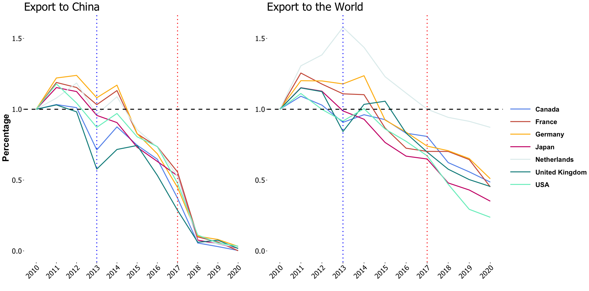
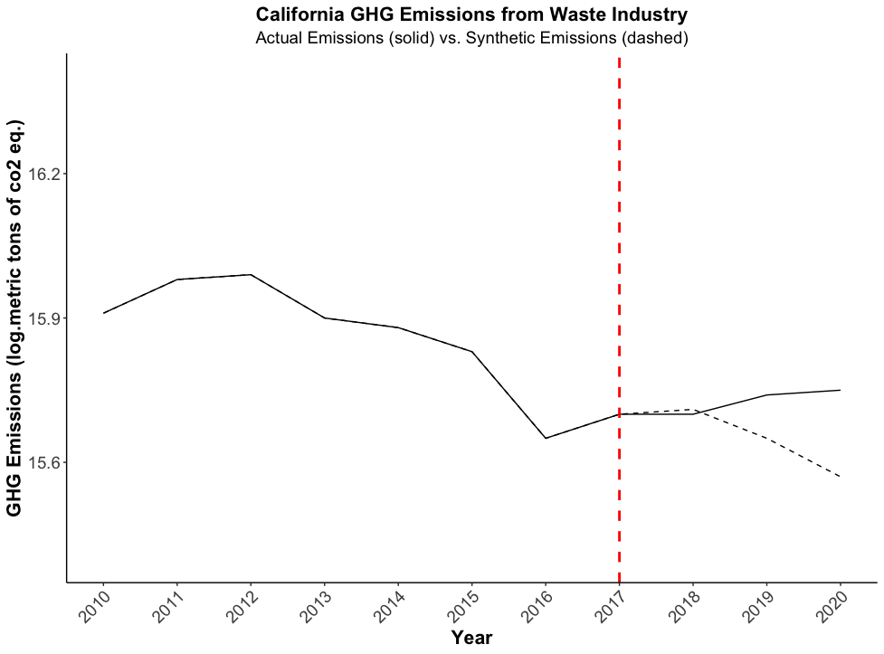
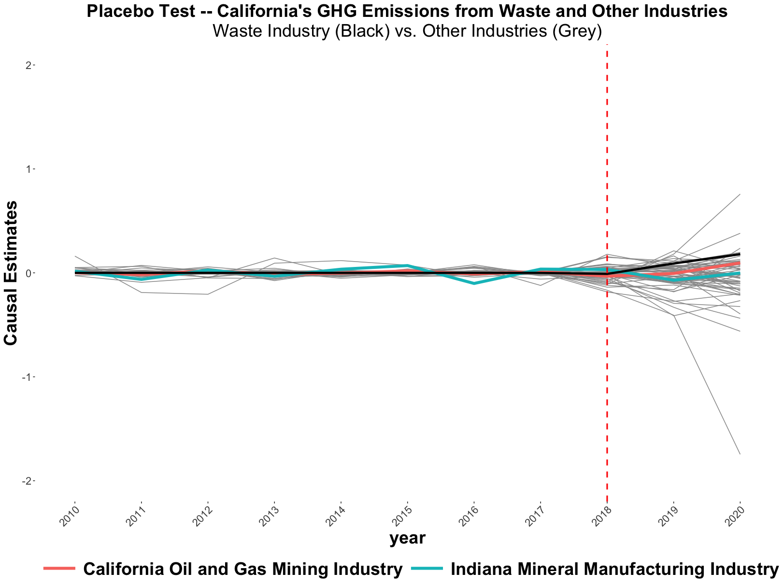
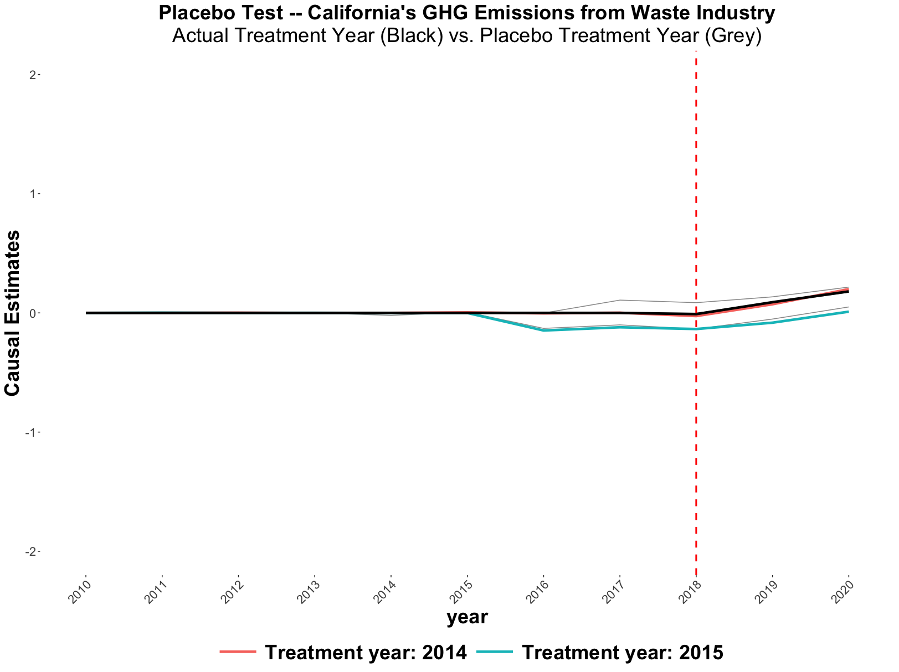
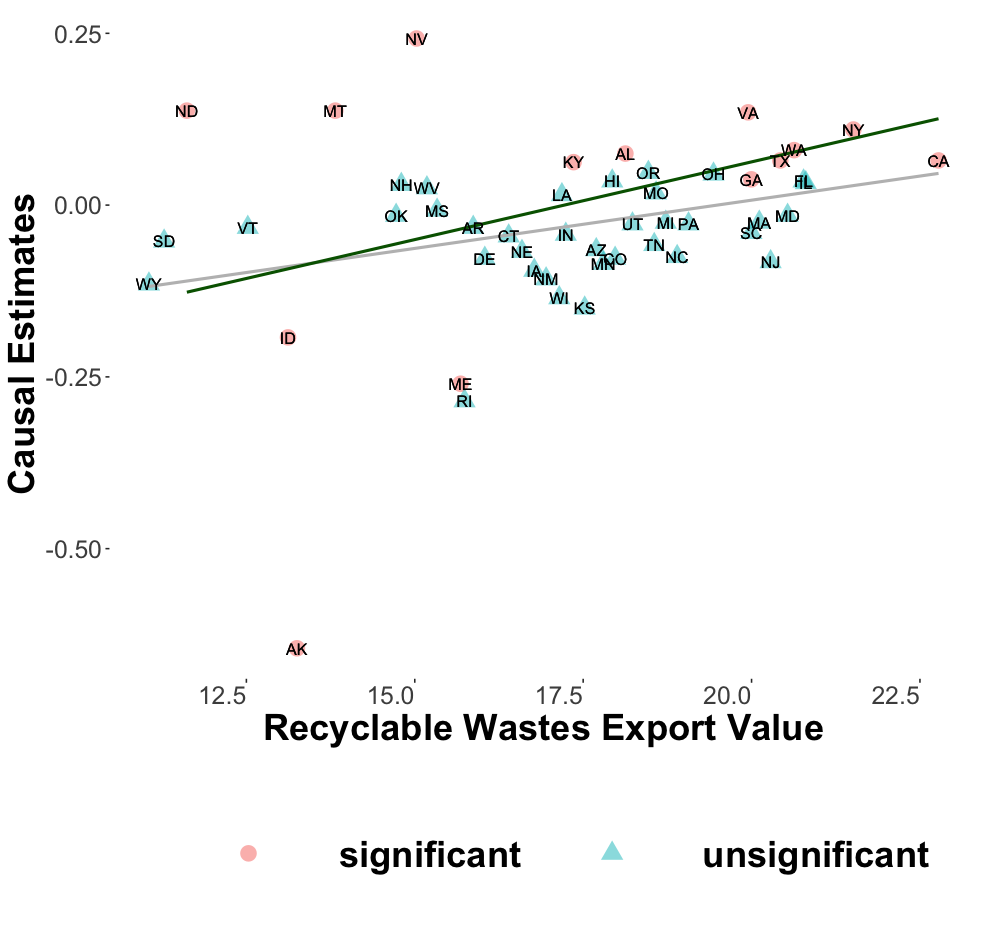
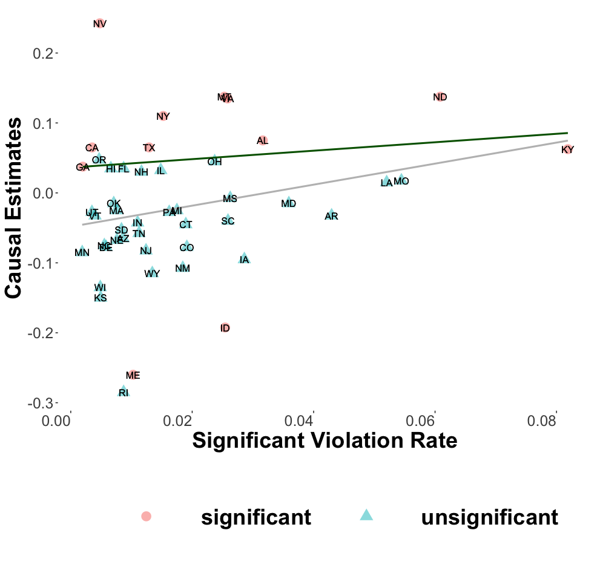
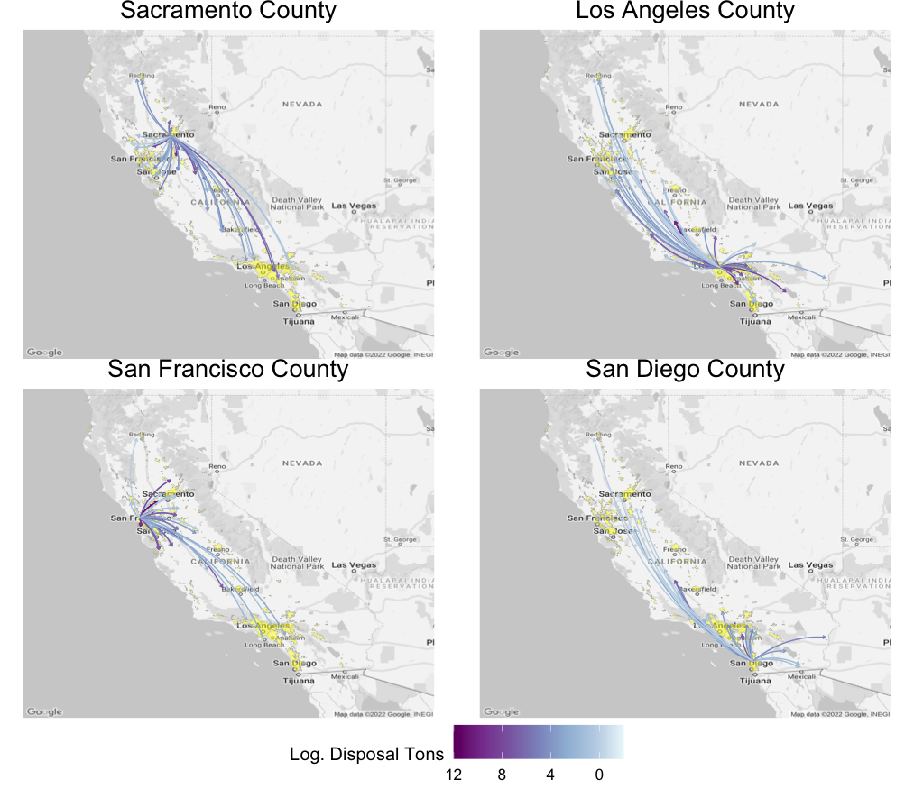
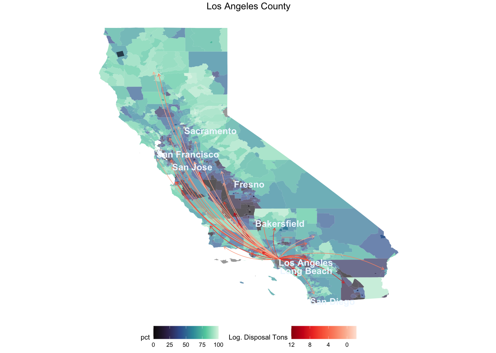
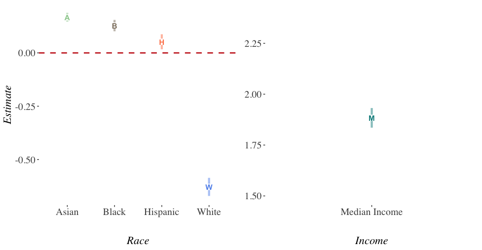
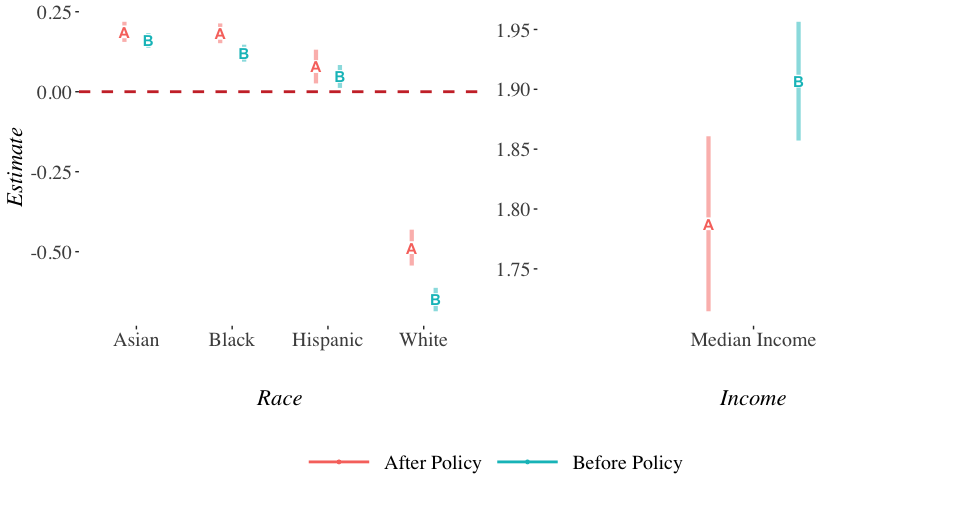

## Introduction

- Recycling rate  **7% &rarr; 32%** from 1960s to present.

--

- For many years, most U.S. recyclables were exported to developing countries.

--

- China was the biggest importer of the U.S. recyclables.

--

- In 2017, China implemented its  **Green Sword (GS) Policy** which banned almost all recyclable waste imports.

--

- Considerable domestic environmental costs: **air pollution** from re-processing of these materials, **landfill methane (GHG) emissions**, **land and water pollution**, as well as **ocean disposal**.

--

- U.S. has no **economical or efficient** recycling infrastructure.

--

- Recyclables went to landfills.
---

##GS Policy and Trade

.center[**Plastic Scrap Export Volume by Countries**]

.center[UN Comtrade Data]
--

- U.S. plastic scrap exports to China dropped by  **99%**.

--

- U.S. plastic scrap exports to the world dropped by  **75%**.
---

## Research Questions

- What is the effect of China's GS policy on  **Domestic Emissions** from landfill facilities in the U.S.? 

--

- What are the key features of states that drive **Heterogeneous Changes** in domestic emissions?

--

- What are the **Distributional Effects** of the GS policy on pollution relocation for local communities at census block levels? 

--

- Does international trade and environmental policy affect local **Environmental Justice (EJ)** problems?

---

## Relevance

**Trade and Environment** 
*Shapiro (2016), Shapiro (2018), Shapiro (2021)*

&rarr; My paper studies the trade policy that directly restricts externality-export and its causal effects on the local emissions in the U.S.

--

**Environmental Gentrification and Environmental Justice** 
*Baden and Coursey (2002), Cameron and McConnaha (2006), Banzhaf and Walsh (2008), Depro et al. (2011), Banzhaf and Walsh (2013), Depro et al. (2015), Banzhaf et al. (2019), Ho (2020), Hernandes and Meng (2020), Shapiro and Walker (2021)*

&rarr; My paper looks at how an exogenous international trade policy affects existing EJ problems in the U.S.

--

**The efficiency of curbside recycling programs** 
*Adaland and Caplan (2006), Bohm et al. (2010), Kinnaman (2014), Kinnaman et al. (2014)* 

&rarr; My paper shows that in the absence of an overseas market for recyclables, the U.S. recycling system is inefficient even though it has the "efficient" recycling rate.

--

**Behavioral Economics of Curbside Recycling** 
*Kurz et al.(2000), Halvorsen (2010), Ashenmiller (2009), Ashenmiller (2011), Best and Kneip (2019), Berck et al. (2020), Berck et al. (2021)*

&rarr; My paper takes the angle of the exogenous trade policy and use it as a tool to explore the relationship between the recycling programs and local environmental outcomes in the U.S.

---
   
## Data
- [U.S. EPA Greenhouse Gas Reporting Program (GHGRP)](https://www.epa.gov/ghgreporting)

 - Methane emissions from landfill facilities 
 - 2010 to 2020 annually 

--

- Why Methane Emission?
 - It can serve as a proxy for general pollution emissions.
 - It is the most "localized" greenhouse gas.

--

- Approximately 8,000 facilities are required to report their emissions annually.

--

- The industries in the system include power plants, petroleum and natural gas systems, minerals, chemicals, pulp and paper, refineries, waste, etc.

---

## Data

- [California Department of Resources Recycling and Recovery (CalRecycle) Disposal Flow Data](https://www.calrecycle.ca.gov/DataCentral/Materials/)

 - captures the amount of disposal transported by origin jurisdiction and destination facility.
 - 2002 to 2021 quarterly
 - contains 464 origin jurisdictions and 263 disposal facilities
 
--

- Other Data Sources

 - U.S. Trade Census 
 - EPA Enforcement and Compliance Historical data
 - Bureau and Labor and Statistics (BLS) Quarterly Employment and Wages at county-level
 - U.S. Census. racial composition and median income at census-block level
  
---

##Identification: Synthetic Control

- Relies on exogenous variation in methane emissions across **all other industries** in the EPA GHGRP.

 - power plants, petroleum and natural gas systems, minerals, chemicals, pulp and paper, refineries, etc.
 
--

- Takes advantage of the fact that other industries which also emit GHG were not affected by China's GS policy.

- Uses other industries from all states to come up with a synthetic control group

--

- Train the model using pre-policy time **2010-2017**
 - calculate weights on state-industry pairs to minimize the prediction error.
$$\hat{Y_{1t}^{N}} = \sum_{j=2}^{J+1} w_{j} Y_{1t}$$

- Predict the counterfactual methane emissions using post-policy time **2018-2020** in the absence of GS policy 

---

## Results

.center[**California**]

- The difference between the actual emission and synthetic emission is the causal effect of China's GS policy on methane emissions.

$$\hat{\tau_{1t}} = Y_{1t} - \hat{Y_{1t}^{N}}$$

---
 
## Placebo Tests

.pull-left[

 
 

- Use control industries as my "fake" treatment industries
]

.pull-right[

 
 

- Use other years (2013-2017) as my "fake" treatment years

]

---

## Results

.pull-left[

-  **&uarr;**  **Recyclable wastes a state exported** &rarr;  **&uarr;**  increase in methane emissions.
]

.pull-right[

-  **&uarr;**  **Rate of significant violations a state has with regard to environmental regulations** &rarr;  **&uarr;**  increase in methane emissions.
]

---

## Pollution Relocation

- How does **International Trade policy** affect **pollution relocation**? 

--

- Does pollution relocate? 
 - **Cap and Trade** Clean Air Act requiring new or expanding plants to pay incumbents in the same or neighboring counties to reduce their pollution emissions (Shapiro and Walker (2021)).
 
--
 
 - **US air pollution offset markets**  Clean Air Act has allowed for trading of permanent pollution emissions rights between firms within a metropolitan area (Shapiro and Walker (2020)).
 
--

 - **Externality-export strategy for air pollution**  Clean Air Act (Morehouse and Rubin (2022))

--
 
 - **Waste flow** Not In my Backyard (NIMBY) regulation limits interstate waste flows (Ho (2020)).

 
---

## Pollution Relocation

.center[**Average net increase in waste flows across regions after the GS policy**]

---

## Pollution Relocation by Racial Composition

---

## Gravity Model 

$$log(Y_{ijt}) = \alpha + \beta_{1} log(Dist_{ij}) + \beta_{2} R_{i} + \beta_{3} R_{j} + \beta_{4} log(X_{it}) + \beta_{5} log(X_{jt}) +$$
$$\epsilon_{o} + \theta_{d} + \mu_{od} + \eta_{t} + \lambda_{odt}$$

- $i$ is the origin jurisdiction of California 

- $j$ is the area that is a 3km buffer within the destination facility

--

- $R_{it}$ and $R_{jt}$ **are racial compositions of origin i and destination j.**

- $Y_{ijt}$ **is the tons of the disposal transported from $i$ to  $j$ in time t.**

--

- $Dist_{ij}$ is the distance between origin i and destination j.

- $X_{it}$ and $X_{jt}$ are socioeconomic factors, regulation of environmental stringency, and economies of scale of waste industry of origin and destination i and j. 

--

- Fixed-effects: $\epsilon_{o}$, $\theta_{d}$, $\mu_{od}$, $\eta_{t}$, $\lambda_{odt}$

---
## Results prior to the GS Policy

.pull-center[
]
.center[**Gravity Model Estimates at Census Block level**]
---

## Results after the GS Policy

.pull-center[
]
.center[**Gravity Model Estimates at Census Block level**]

---

## Conclusion Preliminary Findings

- U.S. State-level Methane Emissions

  - Many states have seen **statistically significant increases** in methane emission caused by the GS policy.
  
  - Heterogeneous changes in domestic methane emissions relate to **historical trade volume of recyclable wastes** and **stringency of environmental regulations**.

--

- Pollution Relocation 
  - Before China's GS policy, waste pollution tend to relocate to **minority communities**.
  
   - After the GS policy, pollution inflows increased more for **low-income white communities** as a result of an increase in waste flows across regions after the exogenous GS policy shock.
   
