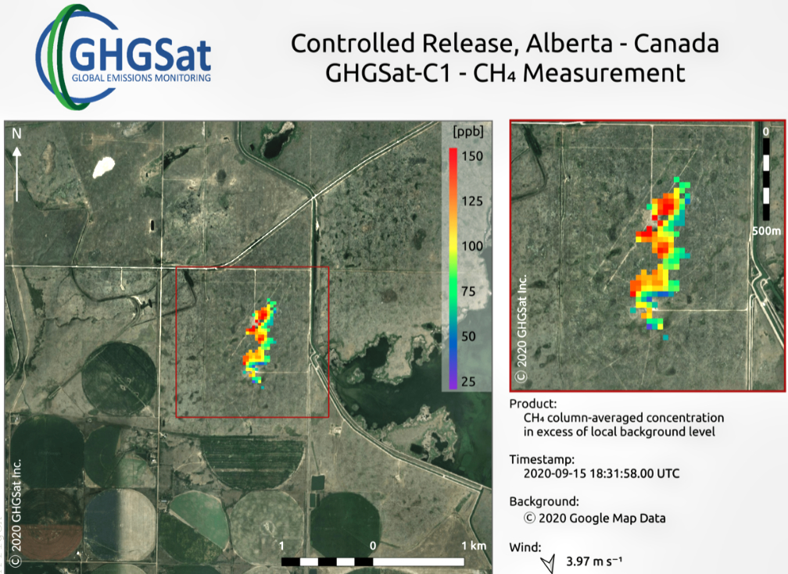
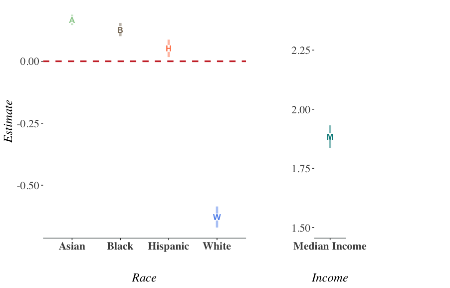
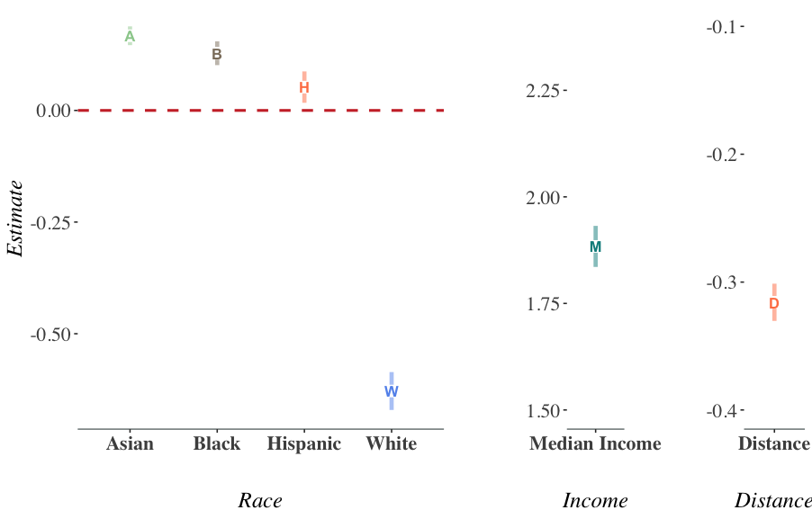
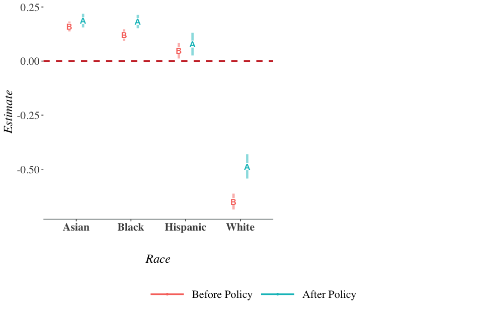

## Introduction

- Recycling rate  **7% &rarr; 32%** from 1960s to present

--

- For many years, most U.S. recyclables were exported to developing countries

--

- China was the biggest importer of U.S. recyclables

--

- In 2017, China implemented its  **Green Sword (GS) Policy** banning almost all recyclable waste imports

--

- Considerable domestic environmental costs
 - **air pollution** from re-processing of these materials
 - **landfill methane (GHG) emissions**
 - **land and water pollution**
 - **ocean disposal**

--

- U.S. has no **economical or efficient** recycling infrastructure
 - Recyclables went to landfills.
---

##GS Policy and Trade

.center[**Plastic Scrap Export Volume by Countries**]

.center[UN Comtrade Data]

--

- U.S. plastic scrap exports to China dropped by  **99%**

---

##GS Policy and Trade

.center[**Plastic Scrap Export Volume by Countries**]

.center[UN Comtrade Data]

- U.S. plastic scrap exports to China dropped by  **99%**

--

- U.S. plastic scrap exports to the ROW  **increased, then  decreased**  after China's GS policy
---

## Research Questions

 
 

- For the **U.S.**

 - What has been the effect of China's GS policy on  **Domestic Emissions** from landfill facilities? 

 
 

--

- For the state of **California**

 - What are the **Distributional Effects** of the GS policy on pollution relocation for local communities at census block levels? 
 - What are **Environmental Justice (EJ)** implications?

---

## Relevance

**Trade and Environment** 
*Shapiro (2016), Shapiro (2018), Shapiro (2021)*

&rarr; My innovation: study a trade policy that directly restricts externality export and explore the policy's causal effects on local emissions in the U.S.

--

**Environmental Gentrification and Environmental Justice** 
*Baden and Coursey (2002), Cameron and McConnaha (2006), Banzhaf and Walsh (2008), Depro et al. (2011), Banzhaf and Walsh (2013), Depro et al. (2015), Banzhaf et al. (2019), Ho (2020), Hernandes and Meng (2020), Shapiro and Walker (2021)*

&rarr; My innovation: examine how an exogenous intl. trade policy affects U.S. EJ problems.

--

**The efficiency of curbside recycling programs** 
*Adaland and Caplan (2006), Bohm et al. (2010), Kinnaman (2014), Kinnaman et al. (2014)* 

&rarr; My innovation: show that in the absence of an overseas market for recyclables, the U.S. recycling system is inefficient even though it has the "efficient" recycling rate.

--

**Behavioral Economics of Curbside Recycling** 
*Kurz et al.(2000), Halvorsen (2010), Ashenmiller (2009), Ashenmiller (2011), Best and Kneip (2019), Berck et al. (2020), Berck et al. (2021)*

&rarr; My innovation: use this exogenous trade policy as a tool to explore the relationship between the recycling programs and local environmental outcomes in the U.S.

---

## Environmental Outcome Measurement

.pull-left[ 

.center[GHGSat’s satellite showed methane from landfills (upper: Buenos Aires, Argentina. lower: Alberta, Canada)]
]

.pull-right[ 
- Why use  **methane** emissions?

 - They are a **proxy** for general pollution emissions
 
 - Methane is far more potent at trapping the sun’s heat than carbon emissions
 
 - Satellite data is available only from 2020
 
 - Need consistently measured emissions data from 2010 to 2020
]
---
   
## Data
- [U.S. EPA Greenhouse Gas Reporting Program (GHGRP)](https://www.epa.gov/ghgreporting)

 - Methane emissions from landfill facilities 
 - 2010 to 2020 annually 

--

- Approximately 8,000 facilities required to report emissions annually

- High compliance rates

--

- Covered industries include power plants, petroleum and natural gas systems, minerals, chemicals, pulp and paper, refineries, waste, etc.

--

- Data generation process:
 - Facilities in waste industry report the **amount of wastes accepted** annually 
 - Methane Emission is calculated through a complicated model embedded in U.S. EPA

---

## Data

- [California Department of Resources Recycling and Recovery (CalRecycle) Disposal Flow Data](https://www.calrecycle.ca.gov/DataCentral/Materials/)

 - Captures the amount of disposal transported by origin jurisdiction and destination facility
 - 2002 to 2021 quarterly
 - Contains 464 origin jurisdictions and 263 disposal facilities
 
--

- Other Data Sources

 - U.S. Trade Census 
 - EPA Enforcement and Compliance Historical data
 - Bureau and Labor and Statistics (BLS) Quarterly Employment and Wages at county level
 - U.S. Census racial mix, median income at census-block level
  
---

##Identification: Synthetic Control Method

- Rely on exogenous variation in methane emissions across **all other industries** in the EPA GHGRP

 - Power plants, petroleum and natural gas systems, minerals, chemicals, pulp and paper, refineries, etc. (**not** waste)
 
--

- Take advantage of the fact that other industries which also emit GHG were not affected by China's GS policy

--

- Use other industries(all states) as donor pool for synthetic control group

--

- Train the model using pre-policy time **2010-2017**
 - calculate state-industry pair weights to minimize prediction error
$$\hat{Y_{1t}^{N}} = \sum_{j=2}^{J+1} w_{j} Y_{1t}$$

- Predict counterfactual methane emissions in the absence of GS policy using post-policy period (**2018-2020**) 

---

## Results

.center[**California**]

- The difference between actual emissions and synthetic emissions is the causal effect of China's GS policy on U.S. landfill methane emissions

$$\hat{\tau_{1t}} = Y_{1t} - \hat{Y_{1t}^{N}}$$

---
 
## Placebo Tests

.pull-left[

 
 

- Use control industries as "fake" treatment industries
]

.pull-right[

 
 

]

---

## Placebo Tests

.pull-left[

 
 

- Use control industries as "fake" treatment industries
]

.pull-right[

 
 

]

---

## Placebo Tests

.pull-left[

 
 

- Use control industries as "fake" treatment industries
]

.pull-right[

 
 

]

---

## Placebo Tests

.pull-left[

 
 

- Use control industries as "fake" treatment industries
]

.pull-right[

 
 

- Use other years (2013-2017) as "fake" treatment years

]

---

## Placebo Tests

.pull-left[

 
 

- Use control industries as "fake" treatment industries
]

.pull-right[

 
 

- Use other years (2013-2017) as "fake" treatment years

]

---

## Placebo Tests

.pull-left[

 
 

- Use control industries as "fake" treatment industries
]

.pull-right[

 
 

- Use other years (2013-2017) as "fake" treatment years

]

---

## Results

.pull-center[

]

.pull-left[
-  **&uarr;**  **Recyclable wastes a state exported** &rarr;  **&uarr;**  increase in methane emissions.
]

---

## Results

.pull-center[

]

.pull-left[
-  **&uarr;**  **Recyclable wastes a state exported** &rarr;  **&uarr;**  increase in methane emissions.
]

.pull-right[
-  **&uarr;**  **State-level rate of "significant"  environmental violations** &rarr;  **&uarr;**  increase in methane emissions.
]

---

## Pollution Relocation

- How does **International Trade policy** affect **pollution relocation**? 

--

- Does pollution relocate? 
 - **Cap and Trade** - Clean Air Act requires new or expanding plants to pay incumbents in the same or neighboring counties to reduce their pollution emissions (Shapiro and Walker (2021)).
 
--
 
 - **US air pollution offset markets** - Clean Air Act allows for trading of permanent pollution emissions rights between firms within a metropolitan area (Shapiro and Walker (2020)).
 
--

 - **Externality-export strategy for air pollution** - Clean Air Act (Morehouse and Rubin (2022))

--
 
 - **Waste flow** - Not In my Backyard (NIMBY) regulations limit interstate waste flows (Ho (2020)).

 
---

## Pollution Relocation

.center[**Average net increase in waste flows across regions after the GS policy**]

---

## Pollution Relocation by Racial Composition

---

## Gravity-type Model 

$$log(Y_{ijt}) = \alpha + \beta_{1} log(Dist_{ij}) + \beta_{2} log(R_{j}) + \beta_{3} log(X_{jt})$$
$$+ \beta_{5} GS_{post} * log(R_{j}) + \beta_{6} GS_{post} * log(X_{jt})$$
$$\epsilon_{o} + \theta_{d} + \mu_{od} + \eta_{t} + \lambda_{odt}$$

-   $i$  origin jurisdiction of California;  $o$  origin county

-   $j$  area that is a 3km buffer within the destination facility;  $d$  destination county

-   $t$   year-quarter

--

- $R_{jt}$  **racial compositions of destination $j$** 

- $Y_{ijt}$  **tons of the disposal transported from $i$ to  $j$ in year quarter $t$ **

- $GS_{post}$  **dummy variable for the GS policy**

- $Dist_{ij}$ distance between origin $i$ and destination $j$ 

-  $X_{jt}$ median income, regulation of environmental stringency, and economies of scale of waste industry of destination $j$  

--

- Fixed-effects: $\epsilon_{o}$, $\theta_{d}$, $\mu_{od}$, $\eta_{t}$, $\lambda_{odt}$

---
## Results prior to the GS Policy

.pull-center[
]
.center[**Gravity Model Estimates at Census Block level**]
---

## Results prior to the GS Policy

.pull-center[
]
.center[**Gravity Model Estimates at Census Block level**]
---

## Results prior to the GS Policy

.pull-center[
]
.center[**Gravity Model Estimates at Census Block level**]
---

## Results after the GS Policy

.pull-center[
]
.center[**Gravity Model Estimates at Census Block level**]

---

## Results after the GS Policy

.pull-center[
]
.center[**Gravity Model Estimates at Census Block level**]

---

## Results after the GS Policy

.pull-center[
]
.center[**Gravity Model Estimates at Census Block level**]
---

## Conclusion Preliminary Findings

- **U.S. State-level Methane Emissions**

  - Many states show statistically significant increases in methane emission
  
  - Relate to historical trade volume, stringency of envir. regulations

--

- **California Pollution Relocation** 

  - Before China's GS policy
  
   Waste tend to relocate to minority communities
   
  - After China's GS policy
  
    Inflows increased more for remote low-income white communities
   
