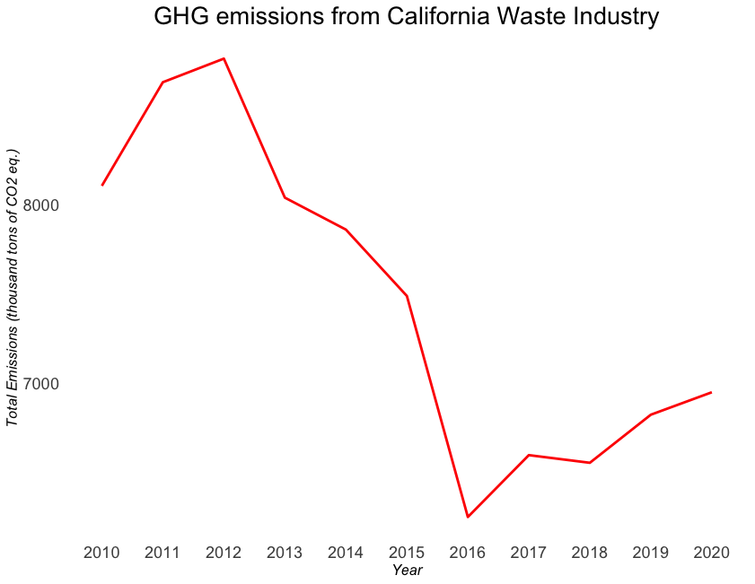
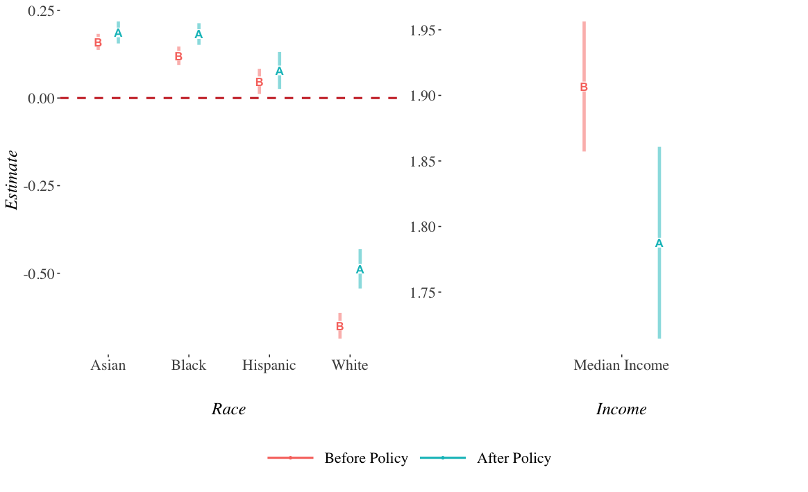

## Introduction

- Recycling has played a pivotal role in preventing the degradation of natural resources in the last few decades.

--

- Recycling rate  **7% &rarr; 32%** from 1960s to currently.

--

- For many years, most U.S. recyclables were exported to developing countries.

--

- China joined the WTO in 2001.

--

- In 2017, China implemented its  **Green Sword (GS) Policy** which banned almost all recyclable waste imports.

--

- Considerable domestic environmental costs: **air pollution** from re-processing of these materials, **landfill methane (GHG) emissions**, **land and water pollution**, as well as **ocean disposal**.

---

## Research Questions

- What is the effect of China's GS policy on  **State-level Methane Emissions** from landfill facilities? 

--

- What are the key features of states that drive **Heterogeneous Changes** in methane emissions?

--

- What are the **Distributional Effects** of the GS policy on pollution relocation for local communities (at both county and census block levels) in the state of California? 

--

- Does international trade and environmental policy affect local **Environmental Justice (EJ)** problems?

---

## Relevance

**The efficiency of curbside recycling programs** 
*Adaland and Caplan (2006), Bohm et al. (2010), Kinnaman (2014), Kinnaman et al. (2014)* 

&rarr; My paper shows that in the absence of an overseas market for recyclables, the U.S. recycling system is inefficient even though it has the "efficient" recycling rate.

--

**Behavioral Economics of Curbside Recycling** 
*Kurz et al.(2000), Halvorsen (2010), Ashenmiller (2009), Ashenmiller (2011), Best and Kneip (2019), Berck et al. (2020), Berck et al. (2021)*

&rarr; My paper takes the angle of the exogenous trade policy and use it as an instrument to explore the relationship between the recycling programs and local environmental outcomes in the U.S.

--

**Trade and Environment** 
*Shapiro (2016), Shapiro (2018), Shapiro (2021)*

&rarr; My paper studies the trade policy that directly restricts externality-export and its causal effects on the local methane emissions in the U.S.

--

**Environmental Gentrafication and Environmental Justice** 
*Baden and Coursey (2002), Cameron and McConnaha (2006), Banzhaf and Walsh (2008), Depro et al. (2011), Banzhaf and Walsh (2013), Depro et al. (2015), Banzhaf et al. (2019), Ho (2020), Hernandes and Meng (2020), Shapiro and Walker (2021)*

&rarr; My paper looks at how an exogenous international trade policy affects existing EJ problems in the U.S.

---
   
## Data
- [U.S. EPA Greenhouse Gas Reporting Program (GHGRP)](https://www.epa.gov/ghgreporting)
 - Methane emissions from landfill facilities 
 - 2010 to 2020 annually 

- Why Methane Emission?
 - It is the most "localized" greenhouse gas.
 - It can serve as a proxy for other pollution.
- Approximately 8,000 facilities are required to report their emissions annually.

- The industries in the system include power plants, petroleum and natural gas systems, minerals, chemicals, pulp and paper, refineries, waste, etc.

---

## Data

- [California Department of Resources Recycling and Recovery (CalRecycle) Disposal Flow Data](https://www.calrecycle.ca.gov/DataCentral/Materials/)

 - captures the amount of disposal transported by origin jurisdiction and destination facility.
 - 2002 to 2021 quarterly
 - contains 464 origin jurisdictions and 263 disposal facilities
 
--

- Control variables

 - U.S. Trade Census 
 - EPA Enforcement and Compliance Historical data
 - Bureau and Labor and Statistics (BLS) Quarterly Employment and Wages at county-level
 - U.S. Census. racial composition and median income at census-block level
  
---

##Identification: Synthetic Control

.pull-left[
- Relies on exogenous variation in methane emissions across all other industries in the EPA GHGRP.
 - power plants, petroleum and natural gas systems, minerals, chemicals, pulp and paper, refineries, etc.

- Takes advantage of the fact that other industries which also emit GHG were not affected by China's GS policy.

- Uses other industries from all states to come up with a synthetic control group
]

.pull-right[

]

---

## Results

.pull-left[
- Train the model using pre-policy time **2010-2017**
 - calculate weights on state-industry pairs to minimize the prediction error.

- Predict the model using post-policy time **2018-2020**
 - use calculated weights to predict the counterfactual methane emissions in the absence of GS policy

]

.pull-right[

.center[**California**]
]

- The difference between the actual emission and synthetic emission is the causal effect of China's GS policy on methane emissions.

---
## Results 

- After the GS policy took effect, states like California, Washington, New York, Virginia and Texas have seen significant increases in methane emissions in their waste industry by 0.5%, 0.51%, 0.6%, 0.55%, and 0.31% respectively.

- Other states like Florida, Georgia, Alabama, Kentucky, Louisiana, Ohio and Oregon have also seen significant increases in methane emissions, by 0.22%, 0.19%, 0.5%, 0.3%, 0.15%, 0.2% and 0.21% respectively.
---

## Results

.pull-left[

- The more **recyclable wastes a state exported** before the GS policy, the more increase in **methane emissions** the state experiences after the GS policy.
]

.pull-right[

- The higher **rate of significant violations** a state has with regard to environmental regulations, the more increase in **methane emissions** in that state after the GS policy.
]

---

## Pollution Relocation

- Does pollution relocate? 
 - **Cap and Trade** Clean Air Act requiring new or expanding plants to pay incumbents in the same or neighboring counties to reduce their pollution emissions (Shapiro and Walker (2021)).
 
--
 
 - **US air pollution offset markets**  Clean Air Act has allowed for trading of permanent pollution emissions rights between firms within a metropolitan area (Shapiro and Walker (2020)).
 
--

 - **Externality-export strategy for air pollution**  Clean Air Act (Morehouse and Rubin (2022))

--
 
 - **Waste flow** Not In my Backyard (NIMBY) regulation limits interstate waste flows (Ho (2020)).

--

- How does **International Trade policy** affect **pollution relocation**? 
 
---

## Pollution Relocation

.center[**Average Net Increase in Waste flow across regions after the GS policy**]
---

## Pollution Relocation by Racial Composition

---

## Pollution Relocation by Racial Composition

---

## Gravity Model 

$$log(Y_{ijt}) = \alpha + \beta_{1} log(Dist_{ij}) + \beta_{2} log(X_{it}) + \beta_{3} log(X_{jt}) +$$
$$\epsilon_{i
} + \theta_{j} + \mu_{ij} + \eta_{t} + \lambda_{ijt}$$

- $i$ is origin jurisdiction of California. 

- $j$ is the area that is a 3km buffer within the destination facility.

- $Y_{ijt}$ is the tons of the disposal transported from $i$ to  $j$ in quarter t.

- $Dist_{ij}$ is the distance between origin i and destination j.

- $X_{it}$ and $X_{jt}$ are racial composition, socioeconomic factors, regulation of environmental stringency, and economies of scale of waste industry of origin and destination i and j. 

- Fixed-effects: $\epsilon_{i}$, $\theta_{j}$, $\mu_{ij}$, $\eta_{t}$, $\lambda_{ijt}$

---
## Result

.pull-center[
]
.center[**Gravity Model Estimates at Census Block level**]
---

## Result

.pull-center[
]
.center[**Gravity Model Estimates at Census Block level**]

---

## Conclusion Preliminary Findings

- U.S. State-level Methane Emissions

  - Many states have seen **statistically significant increases** in methane emission caused by the GS policy.
  
  - Heterogeneous changes in domestic methane emissions relate to **historical trade volume of recyclable wastes** and **stringency of environmental regulations**.

--

- Pollution Relocation 
  - Before China's GS policy, waste pollution tend to relocate to **minority communities**.
  
   - After the GS policy, pollution inflows increased more for **low-income white communities** as a result of an increase in waste flows across regions after the exogenous GS policy shock.
   

---

## Future Work Plan

- Control for **California's wild fires**, which could be a noise in my estimates for GS policy. 

- Examine the relationship between ** vertical integration of waste industry (economies of scale)** of the community and pollution relocation.

- Empirically evaluate if there was **environmental gentrification** happening in the past four decades because of the pollution (waste) relocation.
   