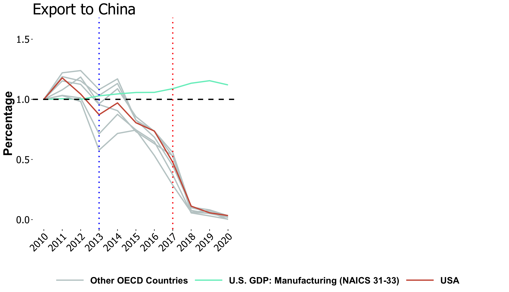
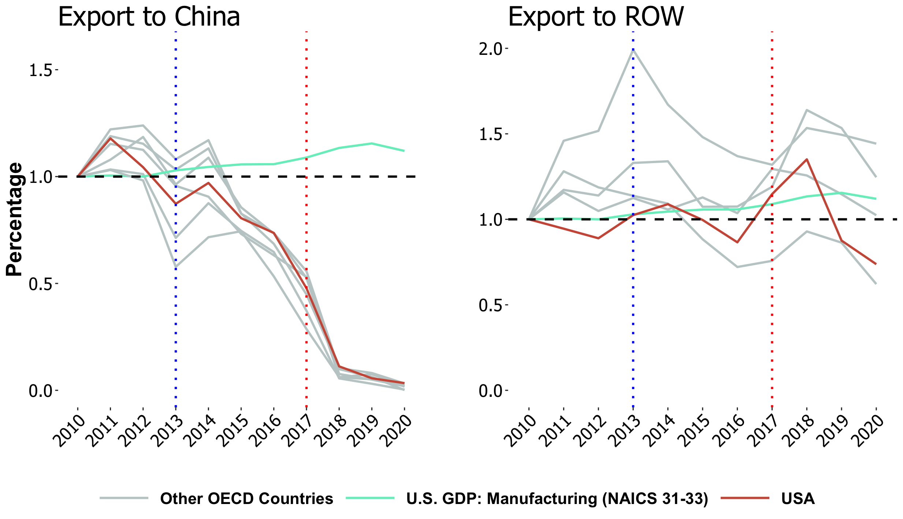
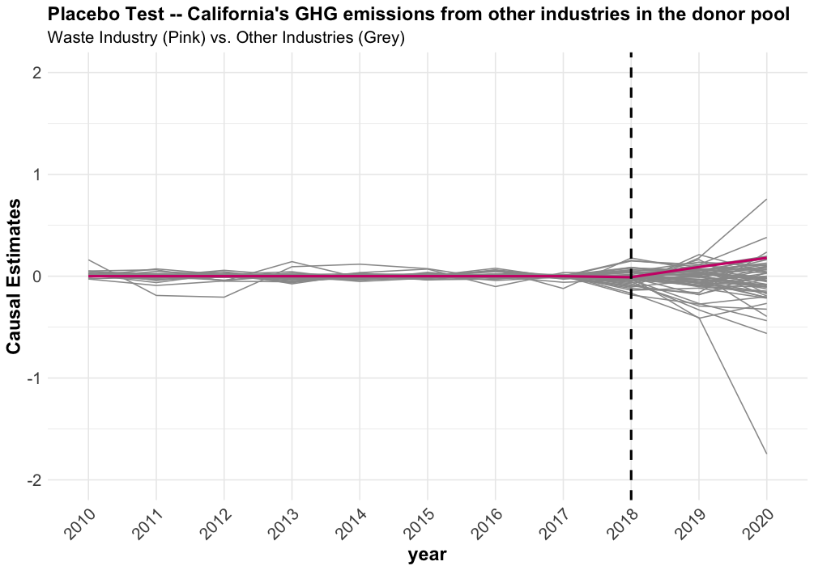
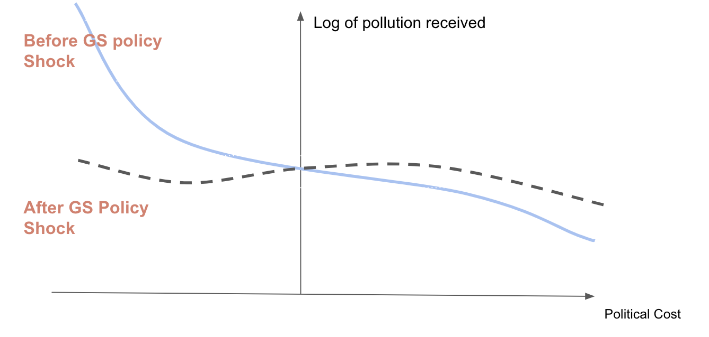
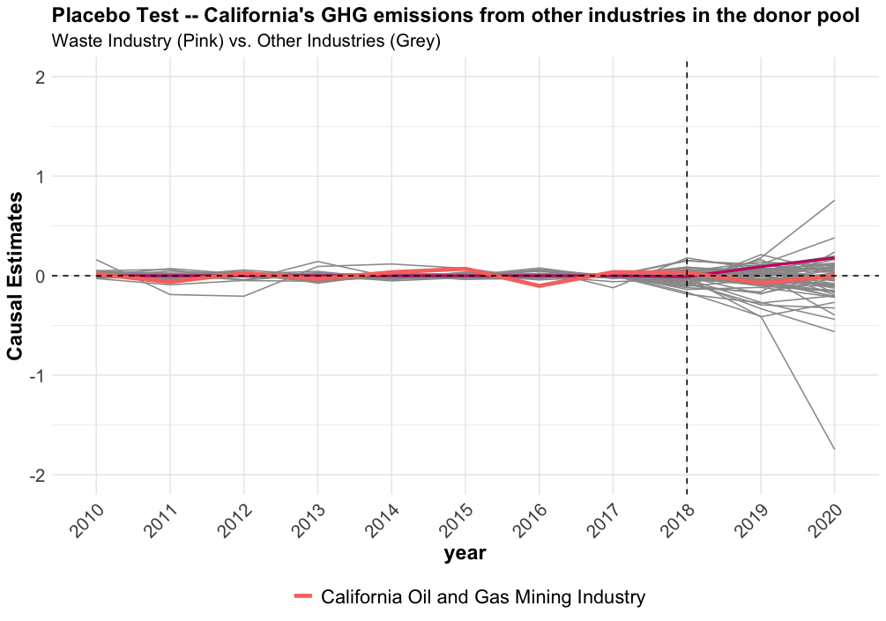

## Introduction

- Recycling rate <span style="color:darkgreen"> **7% &rarr; 32%**</span> from 1960s to present

--

- For many years, most U.S. recyclables exported to developing countries

--

- China was the biggest importer of U.S. recyclables

--

- In 2017, China implemented its <span style="color:darkgreen"> **Green Sword (GS) Policy**</span> banning almost all recyclable waste imports

--

- Considerable domestic environmental costs
 - **air pollution** from re-processing of these materials
 - **landfill methane (GHG) emissions**
 - **land and water pollution**
 - **ocean disposal**

--

- U.S. has no **economical or efficient** recycling infrastructure
 - Recyclables went to landfills.
---


##GS Policy and Trade

.center[**Plastic Scrap Export Volume by Countries**]


.center[UN Comtrade Data]

--

- U.S. plastic scrap exports to China dropped by <span style="color:darkgreen"> **99%**</span>

---


##GS Policy and Trade

.center[**Plastic Scrap Export Volume by Countries**]


.center[UN Comtrade Data]
<font size="3">
- U.S. plastic scrap exports to China dropped by <span style="color:darkgreen"> **99%**</span>

--

- U.S. plastic scrap exports to ROW <span style="color:darkgreen"> **increased, then  decreased** </span> after China's GS policy
---

## Research Questions

<br/>
<br/>

- For the **U.S.**

 - What has been the effect of China's GS policy on <span style="color:darkgreen"> **Domestic Emissions**</span> from landfill facilities? 

--

 - What are the key features of states that drive <span style="color:darkgreen">**Heterogeneous Changes**</span> in domestic emissions?

--


- For the state of **California**

 - What are the <span style="color:darkgreen">**Distributional Effects**</span> of the GS policy on pollution relocation for local communities at census-block levels? 

--

 - What are <span style="color:darkgreen">**Environmental Justice (EJ)**</span> implications? What's the mechanism?


---

## Relevance


<font size="3">**Trade and Environment** 
*Shapiro (2016), Shapiro (2018), Shapiro (2021)*

&rarr; <span style="color:darkgreen">My innovation: Study a trade policy that directly restricts externality export and explore the policy's causal effects on local emissions in the U.S.</span><font size="3">

--

<font size="3">**Environmental Gentrification and Environmental Justice** 
*Baden and Coursey (2002), Cameron and McConnaha (2006), Banzhaf and Walsh (2008), Depro et al. (2011), Banzhaf and Walsh (2013), Depro et al. (2015), Banzhaf et al. (2019), Ho (2020), Hernandes and Meng (2020), Shapiro and Walker (2021)*

&rarr; <span style="color:darkgreen">My innovation: Examine how an exogenous intl. trade policy affects U.S. EJ problems.</span><font size="3">

--

<font size="3">**The efficiency of curbside recycling programs** 
*Adaland and Caplan (2006), Bohm et al. (2010), Kinnaman (2014), Kinnaman et al. (2014)* 

&rarr; <span style="color:darkgreen">My innovation: Show that in the absence of an overseas market for recyclables, the U.S. recycling system is inefficient even though it has the "efficient" recycling rate.</span><font size="3">

--

<font size="3">**Behavioral Economics of Curbside Recycling** 
*Kurz et al.(2000), Halvorsen (2010), Ashenmiller (2009), Ashenmiller (2011), Best and Kneip (2019), Berck et al. (2020), Berck et al. (2021)*

&rarr; <span style="color:darkgreen">My innovation: Use this exogenous trade policy as a tool to explore the relationship between the recycling programs and local environmental outcomes in the U.S.</span><font size="3">


---


   
## Data
- [U.S. EPA Greenhouse Gas Reporting Program (GHGRP)](https://www.epa.gov/ghgreporting)

 - Methane emissions from landfill facilities 
 - 2010 to 2020 annually 

--

- Approximately 8,000 facilities required to report emissions annually

- High compliance rates

--

- Covered industries include power plants, petroleum and natural gas systems, minerals, chemicals, pulp and paper, refineries, waste, etc.

--


- Data generation process:
 - Facilities in waste industry report annual **amount of wastes accepted**  
 - Methane emissions are calculated using a complicated model embedded in U.S. EPA

---

## Data

- [California Department of Resources Recycling and Recovery (CalRecycle) Disposal Flow Data](https://www.calrecycle.ca.gov/DataCentral/Materials/)

 - Captures the amount of disposal transported by origin jurisdiction and destination facility
 - 2002 to 2021 quarterly
 - Contains 464 origin jurisdictions and 263 disposal facilities
 
--

- Other Data Sources

 - U.S. Trade Census 
 - EPA Enforcement and Compliance Historical data
 - Bureau and Labor and Statistics (BLS) Quarterly Employment and Wages at county level
 - U.S. Census racial mix, median income at census-block level
 - Statewide Database (SWDB) election data at precinct level
  
---

##Identification: Synthetic Control Method

- Rely on exogenous variation in methane emissions across <span style="color:darkgreen">**all other industries**</span> in the EPA GHGRP

 - Power plants, petroleum and natural gas systems, minerals, chemicals, pulp and paper, refineries, etc. (**not** waste)
 
--

- Take advantage of the fact that other industries which also emit GHGs were not affected by China's GS policy

--

- Use other industries (all states) as donor pool for synthetic control group

--

- Train the model using the pre-policy period **2010-2017**
 - Calculate state-industry pair weights to minimize prediction error
$$\hat{Y_{1t}^{N}} = \sum_{j=2}^{J+1} w_{j} Y_{1t}$$


- Predict counterfactual methane emissions in the absence of GS policy using post-policy period (**2018-2020**) 


---

## Results


.center[**California**]

- The difference between actual emissions and synthetic emissions is the causal effect of China's GS policy on U.S. landfill methane emissions

$$\hat{\tau_{1t}} = Y_{1t} - \hat{Y_{1t}^{N}}$$

---
 
## Placebo Tests

.pull-center[

.center[**Placebo Test using "Fake" Treatment Industries**]
]


---


## Results
.center[**Correlations of State-level Emission Net Change**]
.pull-center[

]

.pull-center[
- <span style="color:darkgreen"> **&uarr;** </span> **Recyclable wastes a state exported** &rarr; <span style="color:darkgreen"> **&uarr;** </span> increase in methane emissions.
]


---


## Results
.center[Fig.7 **Correlations of State-level Emission Net Change**]
.pull-center[

]

.pull-center[
- <span style="color:darkgreen"> **&uarr;** </span> **State-level rate of "significant"  environmental violations** &rarr; <span style="color:darkgreen"> **&darr;** </span> increase in methane emissions.
]

---


## 

<br/>
<br/>
<br/>
<br/>
<br/>
<br/>
<font size="6">
.pull-center[**Pollution Relocation in California and Environmental Justice**]
<br/>
<br/>
<br/>
---


## Pollution Relocation

.center[**Average net increase in waste flows across regions after the GS policy**]


---

## Pollution Relocation by Racial Composition


---


## Pollution Relocation by Racial Composition
.pull-center[]
<br/>
.center[**Average net increase in waste flows across regions after the GS policy**
]
---

## Gravity-type Model 


$$log(Y_{ijt}) = \alpha + \beta_{1} log(Dist_{ij}) + \beta_{2} log(R_{j}) + \beta_{3} log(X_{jt})$$
$$+ \beta_{5} GS_{post} * log(R_{j}) + \beta_{6} GS_{post} * log(X_{jt})$$
$$\epsilon_{o} + \theta_{d} + \mu_{od} + \eta_{t} + \lambda_{odt}$$


- <font size="3"> <span style="color:darkgreen"> $i$ </span> origin jurisdiction of California; <span style="color:darkgreen"> $o$ </span> origin county<font size="3">

- <font size="3"> <span style="color:darkgreen"> $j$ </span> area that is a 3km buffer within the destination facility; <span style="color:darkgreen"> $d$ </span> destination county<font size="3">

- <font size="3"> <span style="color:darkgreen"> $t$ </span>  year-quarter<font size="3">

--

- $R_{jt}$ <font size="3"> **racial compositions of destination $j$** <font size="3">

- $Y_{ijt}$ <font size="3"> **tons of the disposal transported from $i$ to  $j$ in year quarter $t$ **<font size="3">

- $GS_{post}$ <font size="3"> **dummy variable for the GS policy**<font size="3">

- $Dist_{ij}$ <font size="3">distance between origin $i$ and destination $j$ <font size="3">

-  $X_{jt}$ <font size="3">median income, regulation of environmental stringency, and economies of scale of waste industry of destination $j$  <font size="3">

--

- Fixed-effects: $\epsilon_{o}$, $\theta_{d}$, $\mu_{od}$, $\eta_{t}$, $\lambda_{odt}$


---


## Results prior to the GS Policy

.pull-center[
.center[]
]
.center[**Gravity Model: Key coefficient Estimates at Census-Block level**]
---


## Results after the GS Policy

.pull-center[
.center[]]
.center[**Gravity Model: Key coefficient Estimates at Census-Block level**]

---


## Preliminary Results

**California Pollution Relocation** 

- Before China's GS policy
  
  - Waste tends to flow to <span style="color:darkgreen">**minority communities**</span>

--

- After China's GS policy
  
 - Inflows increased more for <span style="color:darkgreen">** lower-income white communities**</span>
 
--

- Counterintuitive?
    
---


## Mechanism -- Political Costs

- Racial composition of the destination community is highly correlated with voting patterns

.center[]

.center[**Correlation between White percentage by census blocks and Republican share by voting precincts**]

--

- Higher Republican votes, higher percentage of White population

--

- Do disposal inflows to Republican communities increase more due to political costs?
<br/>


---


## Pollution Relocation and Political Costs: Simple model
<font size="3"> 
- Pollution relocation depends on **transportation costs** and **political costs**
$$Y_{ij} = \frac{\overline Y_{i}}{C_{ij}(d_{ij}\cdot f_{ij})\cdot P_{ij}(V{jc})}$$
 - $Y_{ij}$ is pollution relocated from jurisdiction $i$ to facility $j$
 - $\overline Y_{i}$ is the waste pollution generated by jurisdiction $i$
 - $C_{ij}(d_{ij}\cdot f_{ij})$ is a transportation cost function w.r.t distance (overseas/domestic) and fuel price per mile
 - $P_{ij}(V{jc})$ is a political cost function w.r.t. votes in district where facility $j$ located

--

- Political costs depend on the distance between precinct(destination) votes and state-incumbent votes
$$V{jc} = v_{j} - \overline v_{c}$$
 - $v_{j}$ is the votes of the district
 - $v_{c}$ is California's incumbent votes
 - $V_{jc}$ is the political cost of the destination community

--


.pull-left[- Before China's policy shock
 - $C_{ij}(d_{ij}\cdot f_{ij})$ << $P_{ij}(V{jc})$
 - Political costs prevail
 ]

 
.pull-right[- After China's policy shock
 - $C_{ij}(d_{ij}))$ >> $P_{ij}(V{jc})$
 - Marginal political costs deminished
 ]
 

---


## Intuition


.pull-center[

]


- China's GS policy shock shifts the curve flatter (less elastic)
- Excessive pollution relocation shifted from Republican communities to Democratic communities
---


## California Voting by Precinct
.pull-center[
.center[]]
.center[**Disposal flow and Voting by precinct in California**]

---


## Mechanism -- Political Costs
.pull-left[
.center[**Before China's GS Policy**]

- Facilities in Republican communities (low political costs) received more waste pollution
]


---


## Mechanism -- Political Costs


.pull-left[
.center[**Before China's GS Policy**]

- Facilities in Republican communities (low political costs) received more waste pollution
]


.pull-right[
.center[**After China's GS Policy**]

- Facilities from Democratic communities (relatively higher political costs) received more waste pollution
]

---


## Conclusion Preliminary Findings

- **U.S. State-level Methane Emissions**

  - Many states: <span style="color:darkgreen">statistically significant increases</span> in methane emissions
  
  - Relate to <span style="color:darkgreen">historical trade volume</span>, <span style="color:darkgreen">stringency of envir. regulations</span>

--

- **California Pollution Relocation** 

  - Before China's GS policy
  
   Waste tend to relocate to <span style="color:darkgreen">minority communities</span>
   
  - After China's GS policy
  
    Inflows increased more for <span style="color:darkgreen">remote lower income white communities</span>
    
   - Potential mechanism 
   
   Waste tended to relocate to places that have <span style="color:darkgreen">**lower political costs**</span>. After GS policy shock, pollution relocated more to higher political costs places
   
---

##Thank you

.pull-center[

<br/>
<br/>

**Questions?**


Shan Zhang, Department of Economics, University of Oregon

szhang6@uoregon.edu]

---

## Placebo Tests

.pull-center[

.center[Fig.6 **Placebo Test using "Fake" Treatment Industries**]
]


---


## Placebo Tests

.pull-center[

.center[Fig.6 **Placebo Test using "Fake" Treatment Industries**]
]

---

## Appendix: Environmental Outcome Measurement

.pull-left[ 


.center[Fig.4 **PM2.5 from landfill sources by distance upper) and GHGSat’s satellite showed methane from landfills (bottom)**]
]


.pull-right[ 
- Why use <span style="color:darkgreen"> **methane**</span> emissions?

 - Need consistently measured emissions data from 2010 to 2020

 - They are a **proxy** for general pollution emissions:**organic hazardous air pollutants (HAP), volatile organic compounds (VOC), hydrogen sulfide**, etc. 
 
 - Methane is far more potent at trapping the sun’s heat than carbon emissions


]

---

## Appendix: Racial variation

.pull-left[

]
.pull-right[

]
.center[Fig.10 **Racial variation within the county**]
---


## Appendix: Data Source Comparison


.pull-left[
]
.pull-right[
]


---


## Voting variation

.pull-left[

]
.pull-right[

]
.center[Fig.15 **Voting variation within the county**]
---

## Regression Result

**OLS Regression**
$$log(Y_{ijt}) = \alpha + \beta_{1} P_{j}(Vjc) + \beta_{2} GS_{post} * P_{j}(Vjc) + \beta_{3}log(X_{jt})$$
$$\epsilon_{o} + \theta_{d} + \mu_{od} + \eta_{t} + \lambda_{odt}$$

```{r table2, echo=FALSE, message=FALSE, warnings=FALSE, results='asis'}
tabl <- "
|                         | Overall            | Republican   | Democrats  |
|---------------          |:-------------:     |------:       |------:     |
| Political Cost j        | -0.144             |   -1.2584    |0.59845     |
|                         |(0.062)             | (0.101)      |(0.439)     |
| Post * Political Cost j | 0.726              |  1.113408    | -3.32037   |
|                         |(0.109)             | (0.171)      |(0.605)     |
|Controls                 | Y                  |  Y           | Y          |
|County d FE              | Y                  |  Y           | Y          |
|Year FE                  | Y                  |  Y           | Y          |
|Quarter FE               | Y                  |  Y           | Y          |
|Two-way clustered SD     | Y                  |  Y           | Y          |
"
cat(tabl) # output the table in a format good for HTML/PDF/docx conversion
```


