## Recycling: Movitation 1

.pull-left[

]

.pull-right[
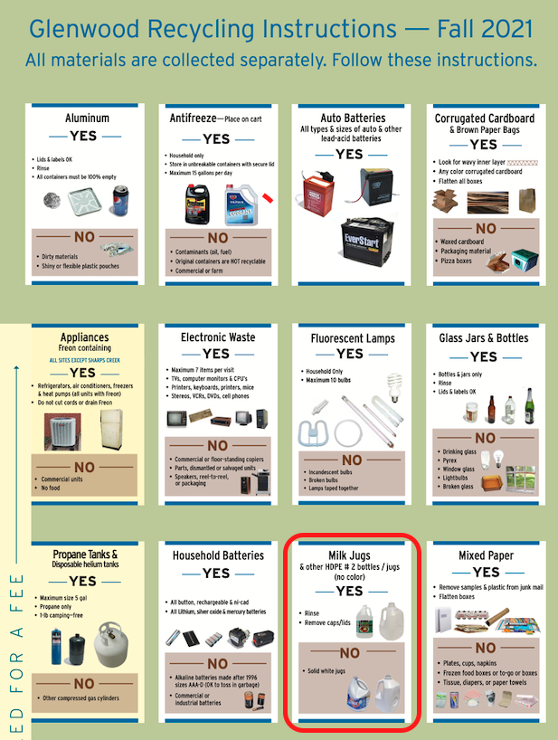
]

.center[Fig.1 **Lane County (OR) Recycling Posters 2015 vs. 2021**]

---

## Recycling: Movitation 2
.center[]
.center[Fig.2 **News and Articles about Recycling in the U.S.**]

---


## Recycling: Movitation 3

.pull-left[
- [So, Should We Recycle?](https://www.npr.org/2019/07/12/741283641/episode-926-so-should-we-recycle) 
July 12, 2019

- [Waste Land](https://www.npr.org/2020/09/11/912150085/waste-land) September 11, 2020
**Won duPont-Columbia Award**

- [Is Recycling Worth It Anymore? People On The Front Lines Say Maybe Not.](https://www.npr.org/2021/04/21/987111675/video-is-recycling-worth-it-anymore-people-on-the-front-lines-say-maybe-not) April 21, 2021
<br/>
 **"The Litter Myth"**
]


.pull-right[

]
---


## Introduction

- Recycling rate <span style="color:darkgreen"> **7% &rarr; 32%**</span> from 1960s to present.

--

- For many years, most U.S. recyclables were exported to developing countries.

--

- China was the biggest importer of the U.S. recyclables.

--

- In 2017, China implemented its <span style="color:darkgreen"> **Green Sword (GS) Policy**</span> which banned almost all recyclable waste imports.

--

- Considerable domestic environmental costs: **air pollution** from re-processing of these materials, **landfill methane (GHG) emissions**, **land and water pollution**, as well as **ocean disposal**.

--

- U.S. has no **economical or efficient** recycling infrastructure.

--

- Recyclables went to landfills.

---


##GS Policy and Trade


.center[Fig.3 **Plastic Scrap Export Volume by Countries (UN Comtrade Data)**]

--

- U.S. plastic scrap exports to China dropped by <span style="color:darkgreen"> **99%**</span>

---


##GS Policy and Trade


.center[Fig.3 **Plastic Scrap Export Volume by Countries (UN Comtrade Data)**]

- U.S. plastic scrap exports to China dropped by <span style="color:darkgreen"> **99%**</span>

--

- U.S. plastic scrap exports to the ROW <span style="color:darkgreen"> **increased, then  decreased** </span> after China's GS policy
---


## Research Questions

- What is the effect of China's GS policy on <span style="color:darkgreen"> **Domestic Emissions**</span> from landfill facilities in the U.S.? 

--


- What are the key features of states that drive <span style="color:darkgreen">**Heterogeneous Changes**</span> in domestic emissions?

--


- What are the <span style="color:darkgreen">**Distributional Effects**</span> of the GS policy on pollution relocation for local communities at census block levels? 

--


- Does international trade and environmental policy affect local <span style="color:darkgreen">**Environmental Justice (EJ)**</span> problems? What's the mechanism behind?


---

## Relevance


<font size="3">**Trade and Environment** 
*Shapiro (2016), Shapiro (2018), Shapiro (2021)*

&rarr; <span style="color:darkgreen">My paper studies the trade policy that directly restricts externality-export and its causal effects on the local emissions in the U.S.</span><font size="3">

--

<font size="3">**Environmental Gentrafication and Environmental Justice** 
*Baden and Coursey (2002), Cameron and McConnaha (2006), Banzhaf and Walsh (2008), Depro et al. (2011), Banzhaf and Walsh (2013), Depro et al. (2015), Banzhaf et al. (2019), Ho (2020), Hernandes and Meng (2020), Shapiro and Walker (2021)*

&rarr; <span style="color:darkgreen">My paper looks at how an exogenous international trade policy affects existing EJ problems in the U.S.</span><font size="3">

--

<font size="3">**The efficiency of curbside recycling programs** 
*Adaland and Caplan (2006), Bohm et al. (2010), Kinnaman (2014), Kinnaman et al. (2014)* 

&rarr; <span style="color:darkgreen">My paper shows that in the absence of an overseas market for recyclables, the U.S. recycling system is inefficient even though it has the "efficient" recycling rate.</span><font size="3">

--

<font size="3">**Behavioral Economics of Curbside Recycling** 
*Kurz et al.(2000), Halvorsen (2010), Ashenmiller (2009), Ashenmiller (2011), Best and Kneip (2019), Berck et al. (2020), Berck et al. (2021)*

&rarr; <span style="color:darkgreen">My paper takes the angle of the exogenous trade policy and use it as a tool to explore the relationship between the recycling programs and local environmental outcomes in the U.S.</span><font size="3">


---

## Roadmap
- Data
  - EPA GreenHouse Gas Report System (GHGRP)
  - CalRecycle Recycling and Disposal Reporting System (RDRS) Disposal Flow
  - U.S. Census, Trade Census, BLS, Precinct-level election data etc.

- Identification
 - Synthetic Control
 - Gravity-type fixed effects
 
- U.S. State-level Methane Emissions

- Pollution Relocation 

- Environmental Justice

- Political Costs

---

## Preliminary Findings

- U.S. State-level Methane Emissions

  - Many states have seen <span style="color:darkgreen">**statistically significant increases**</span> in methane emission caused by the GS policy.
  
  - Heterogeneous changes in domestic methane emissions relate to <span style="color:darkgreen">**historical trade volume of recyclable wastes**</span> and <span style="color:darkgreen">**stringency of environmental regulations**</span>.

--

- Pollution Relocation 
  - Before China's GS policy, waste pollution tended to relocate to <span style="color:darkgreen">**minority communities**</span>.
  
   - After the GS policy, pollution inflows increased more for <span style="color:darkgreen">**low-income White communities**</span> as a result of an increase in waste flows across regions after the exogenous GS policy shock.
   
   - Political costs is able to explain this counterintuitive finding
   
---

## Environmental Outcome Measurement

.pull-left[ 
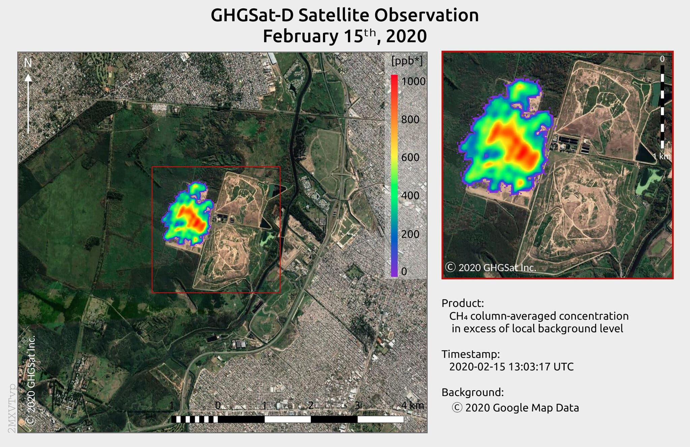

.center[Fig.4 **GHGSat’s satellite showed methane from landfills (upper: Buenos Aires, Argentina. lower: Alberta, Canada)**]
]


.pull-right[ 
- Why use <span style="color:darkgreen"> **methane**</span> emissions?

 - Need consistently measured emissions data from 2010 to 2020

 - They are a **proxy** for general pollution emissions:**organic hazardous air pollutants (HAP), volatile organic compounds (VOC), hydrogen sulfide**, etc. 
 
 - Methane is far more potent at trapping the sun’s heat than carbon emissions


]
---


## Data
- [U.S. EPA Greenhouse Gas Reporting Program (GHGRP)](https://www.epa.gov/ghgreporting)

 - Methane emissions from landfill facilities 
 - 2010 to 2020 annually 

--

- Approximately 8,000 facilities required to report emissions annually

- High compliance rates

--

- Covered industries include power plants, petroleum and natural gas systems, minerals, chemicals, pulp and paper, refineries, waste, etc.

--

- Data generation process:
 - Facilities in waste industry report the **amount of wastes accepted** annually 
 - Methane Emission is calculated through a complicated model embedded in U.S. EPA

---


## Data

- [California Department of Resources Recycling and Recovery (CalRecycle) Disposal Flow Data](https://www.calrecycle.ca.gov/DataCentral/Materials/)

 - captures the amount of disposal transported by origin of jurisdiction and destination of facility.
 - 2002 to 2021 quarterly
 - contains 464 origin jurisdictions and 263 disposal facilities
 
--

- Other Data Sources

 - U.S. Trade Census 
 - EPA Enforcement and Compliance Historical data
 - Bureau and Labor and Statistics (BLS) Quarterly Employment and Wages at county-level
 - U.S. Census. racial composition and median income at census-block level
 - Statewide Database (SWDB) election data at precinct level
  
---

##Identification: Synthetic Control

- Relies on exogenous variation in methane emissions across <span style="color:darkgreen">**all other industries**</span> in the EPA GHGRP.

 - power plants, petroleum and natural gas systems, minerals, chemicals, pulp and paper, refineries, etc.
 
--

- Takes advantage of the fact that other industries which also emit GHG were not affected by China's GS policy.

- Uses other industries from all states to come up with a synthetic control group

--

- Train the model using pre-policy time **2010-2017**
 - calculate weights on state-industry pairs to minimize the prediction error.
$$\hat{Y_{1t}^{N}} = \sum_{j=2}^{J+1} w_{j} Y_{1t}$$


- Predict the counterfactual methane emissions using post-policy time **2018-2020** in the absence of GS policy 


---

## Results

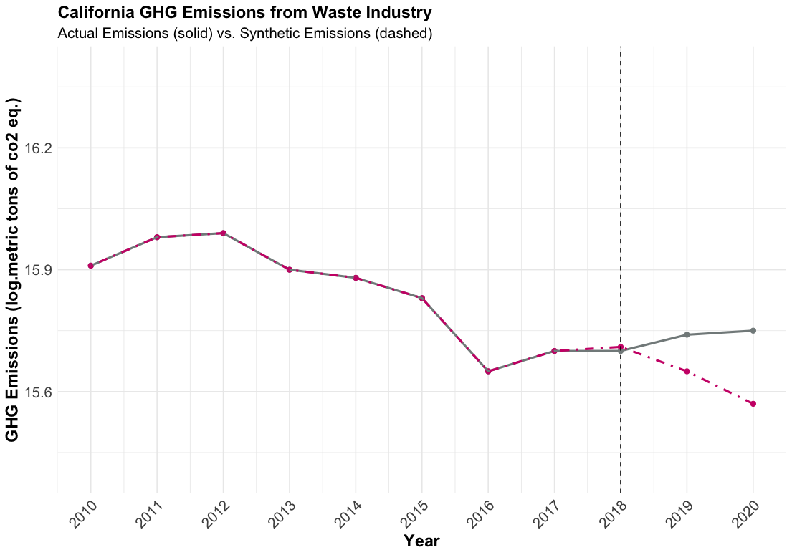
.center[Fig.5 **California Waste Industry Emission Synthetic Control**]

- The difference between actual emissions and synthetic emissions is the causal effect of China's GS policy on U.S. landfill methane emissions

$$\hat{\tau_{1t}} = Y_{1t} - \hat{Y_{1t}^{N}}$$

---

## Placebo Tests

.pull-center[

.center[Fig.6 **Placebo Test using "Fake" Treatment Industries**]
]


---

## Placebo Tests

.pull-center[

.center[Fig.6 **Placebo Test using "Fake" Treatment Industries**]
]


---


## Placebo Tests

.pull-center[

.center[Fig.6 **Placebo Test using "Fake" Treatment Industries**]
]

---

## Results
.center[Fig.7 **Correlations of State-level Emission Net Change**]
.pull-center[

]

.pull-left[
- <span style="color:darkgreen"> **&uarr;** </span> **Recyclable wastes a state exported** &rarr; <span style="color:darkgreen"> **&uarr;** </span> increase in methane emissions.
]


---


## Results
.center[Fig.7 Correlations of State-level Emission Net Change]
.pull-center[
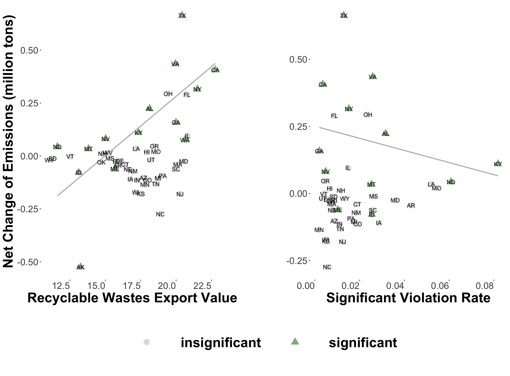
]

.pull-left[
- <span style="color:darkgreen"> **&uarr;** </span> **Recyclable wastes a state exported** &rarr; <span style="color:darkgreen"> **&uarr;** </span> increase in methane emissions.
]

.pull-right[
- <span style="color:darkgreen"> **&uarr;** </span> **State-level rate of "significant"  environmental violations** &rarr; <span style="color:darkgreen"> **&darr;** </span> increase in methane emissions.
]

---

## Pollution Relocation

- How does <span style="color:darkgreen">**International Trade policy**</span> affect <span style="color:darkgreen">**pollution relocation**</span>? 

--

- Does pollution relocate? 
 - **Cap and Trade** Clean Air Act requiring new or expanding plants to pay incumbents in the same or neighboring counties to reduce their pollution emissions (Shapiro and Walker (2021)).
 
--
 
 - **US air pollution offset markets**  Clean Air Act has allowed for trading of permanent pollution emissions rights between firms within a metropolitan area (Shapiro and Walker (2020)).
 
--

 - **Externality-export strategy for air pollution**  Clean Air Act (Morehouse and Rubin (2022))

--
 
 - <span style="color:darkgreen">**Waste flow**</span> Not In my Backyard (NIMBY) regulation limits interstate waste flows (Ho (2020)).


 
---

## California Pollution Relocation


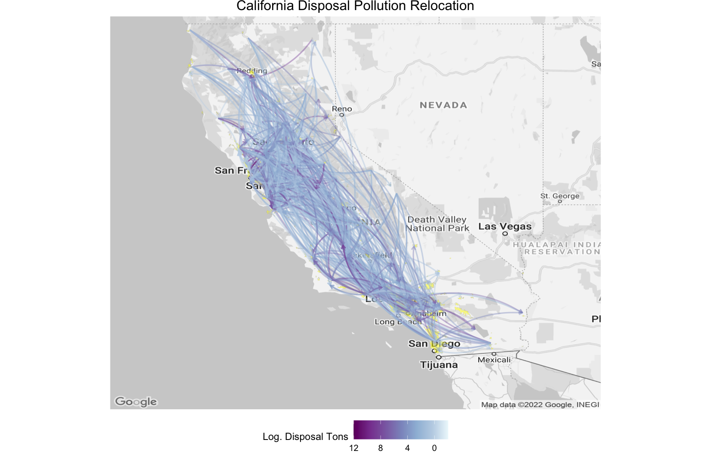
.center[Fig.8 **Average Net Increase in Waste flow across regions before and after the GS policy**]
---


## Pollution Relocation


.center[Fig.8 **Average Net Increase in Waste flow from four source cities before and after the GS policy**]
---

## Pollution Relocation by Racial Composition


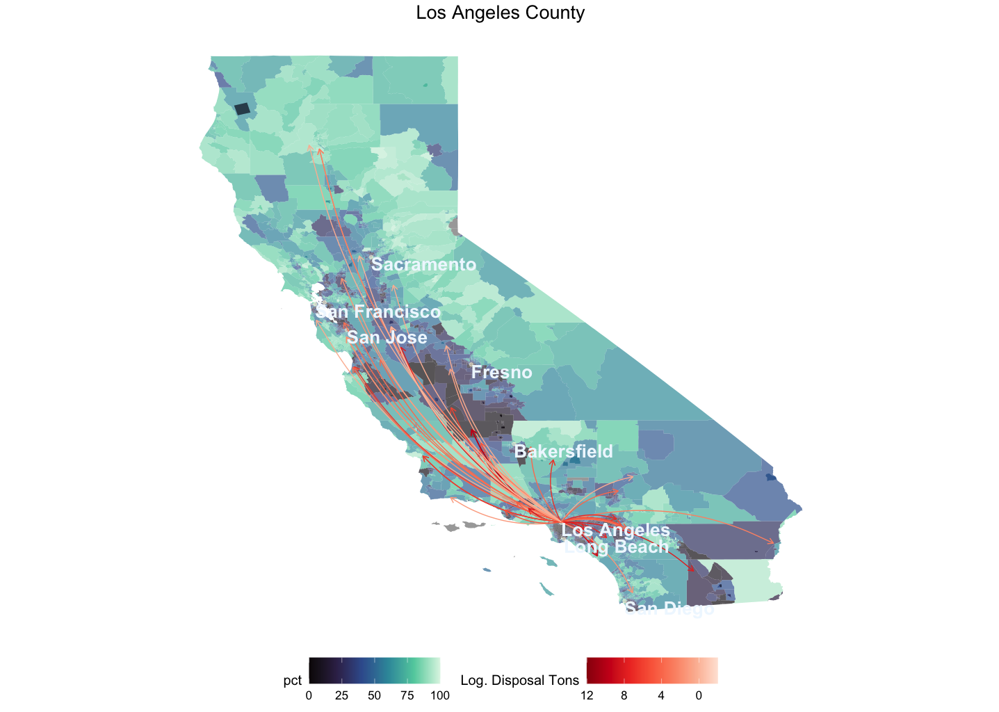

---


## Pollution Relocation by Racial Composition
.pull-left[]
.pull-right[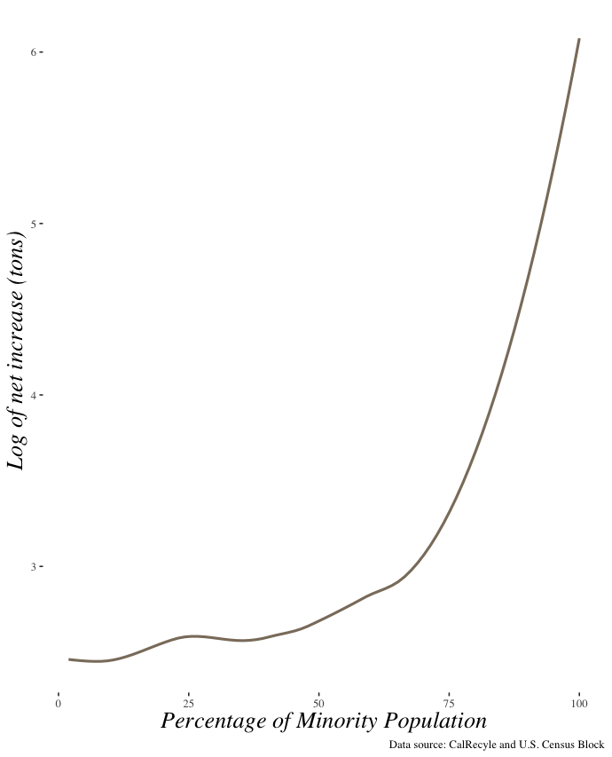]
<br/>
.center[
Fig.9 **Average net increase in waste flows across regions after the GS policy**
]
---


## Gravity-type Model 


$$Y_{ijt} = \alpha + \beta_{1} log(Dist_{ij}) + \beta_{2} log(R_{j}) + \beta_{3} log(X_{jt})$$
$$+ \beta_{5} GS_{post} * log(R_{j}) + \beta_{6} GS_{post} * log(X_{jt})$$
$$\epsilon_{o} + \theta_{d} + \mu_{od} + \eta_{t} + \lambda_{odt}$$


- <font size="3"> <span style="color:darkgreen"> $i$ </span> origin jurisdiction of California; <span style="color:darkgreen"> $o$ </span> origin county<font size="3">

- <font size="3"> <span style="color:darkgreen"> $j$ </span> area that is a 3km buffer within the destination facility; <span style="color:darkgreen"> $d$ </span> destination county<font size="3">

- <font size="3"> <span style="color:darkgreen"> $t$ </span>  year-quarter<font size="3">

--

- $R_{jt}$ <font size="3"> **racial compositions of destination $j$** <font size="3">

- $Y_{ijt}$ <font size="3"> **tons of the disposal transported from $i$ to  $j$ in year quarter $t$ **<font size="3">

- $GS_{post}$ <font size="3"> **dummy variable for the GS policy**<font size="3">

- $Dist_{ij}$ <font size="3">distance between origin $i$ and destination $j$ <font size="3">

-  $X_{jt}$ <font size="3">median income, regulation of environmental stringency, and economies of scale of waste industry of destination $j$  <font size="3">

--

- Fixed-effects: $\epsilon_{o}$, $\theta_{d}$, $\mu_{od}$, $\eta_{t}$, $\lambda_{odt}$


---


## Variables of Interest
.pull-left[
<font size="3.5">
<span style="color:darkgreen">Main variables</span>

- $R_{j}$  **racial compositions (percentage)**

 - Census Block level data 
 - decennial data
 - use 2010, time invariant, spatial variant


- $Dist_{ij}$ **distance between origin and destination** 

 - CalRecycle data
 - population centroid coordinates of the origin jurisdictions
 - coordinates of destination facilities
 - time invariant, spatial variant

]

--

.pull-right[
<font size="3.5">
<span style="color:darkgreen">Within $X_{j}$ </span>

- **Median income**

 - Census Block level data
 - use 2010, time invariant, spatial variant
 

 
- **Regulation of environmental stringency**

 - EPA Compliance History Data
 - time invariant
 

 
- **Economies of scale** 

 - Waste Business Journal (industrial data)
 - Spatial definition: See appendix Fig A 3.3 and Fig A 3.4
 - time invariant, spatial variant

]

--


.pull-left[<font size="3.5">
<br/>
<br/>
 - **Interactions of above variables with the policy dummy variable**
]


---

## Racial variation

.pull-left[

]
.pull-right[
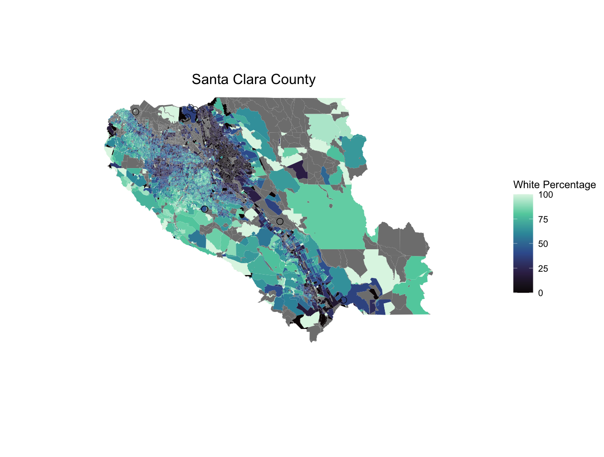
]
.center[Fig.10 **Racial variation within the county**]
---


## Results prior to the GS Policy

.pull-center[
.center[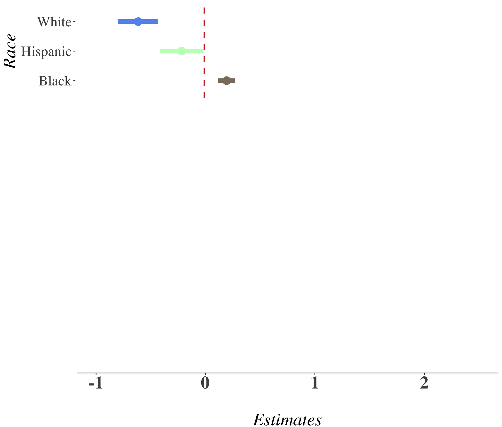]
]
.center[Fig.11 **Gravity Model Estimates at Census Block level**]
---

## Results prior to the GS Policy

.pull-center[
.center[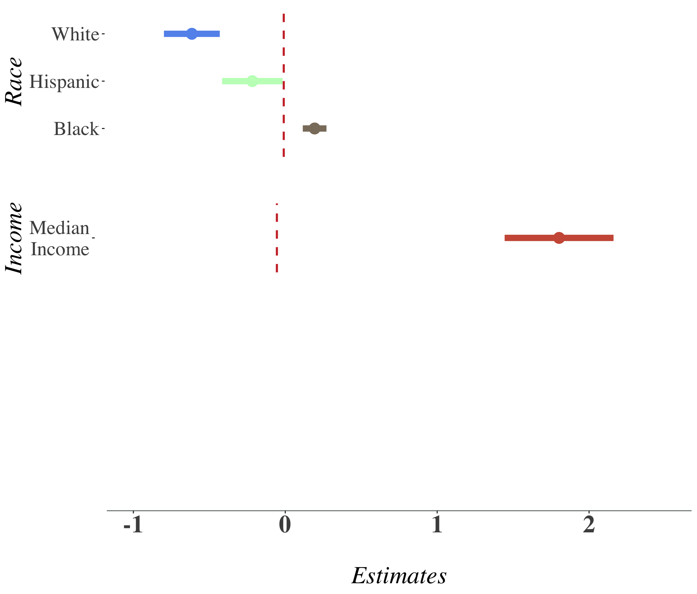]
]
.center[Fig.11 **Gravity Model Estimates at Census Block level**]
---

## Results prior to the GS Policy

.pull-center[
.center[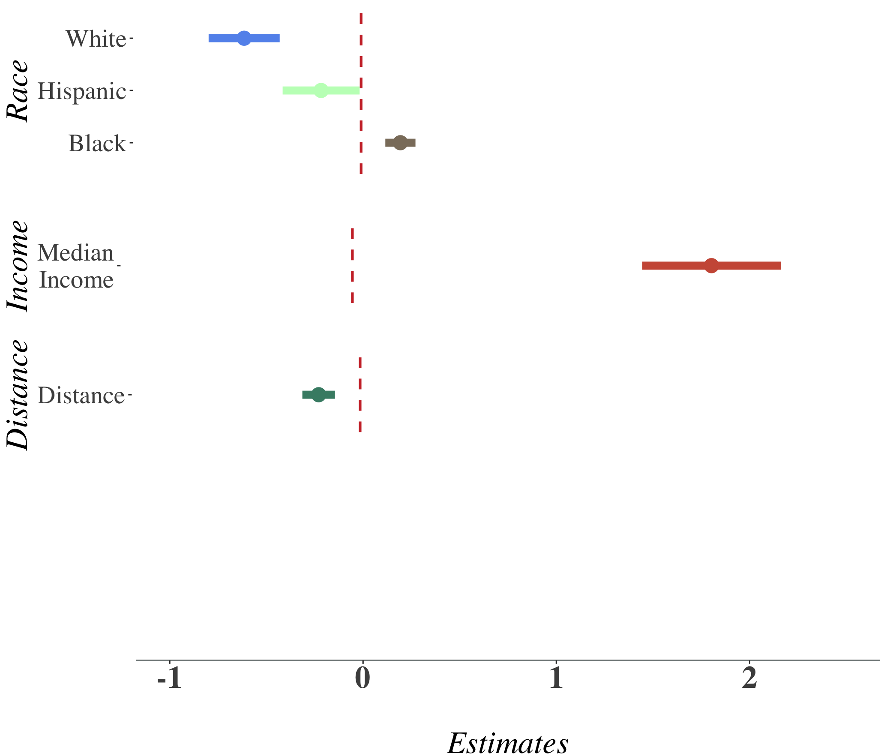]
]
.center[Fig.11 **Gravity Model Estimates at Census Block level**]
---

## Results prior to the GS Policy

.pull-center[
.center[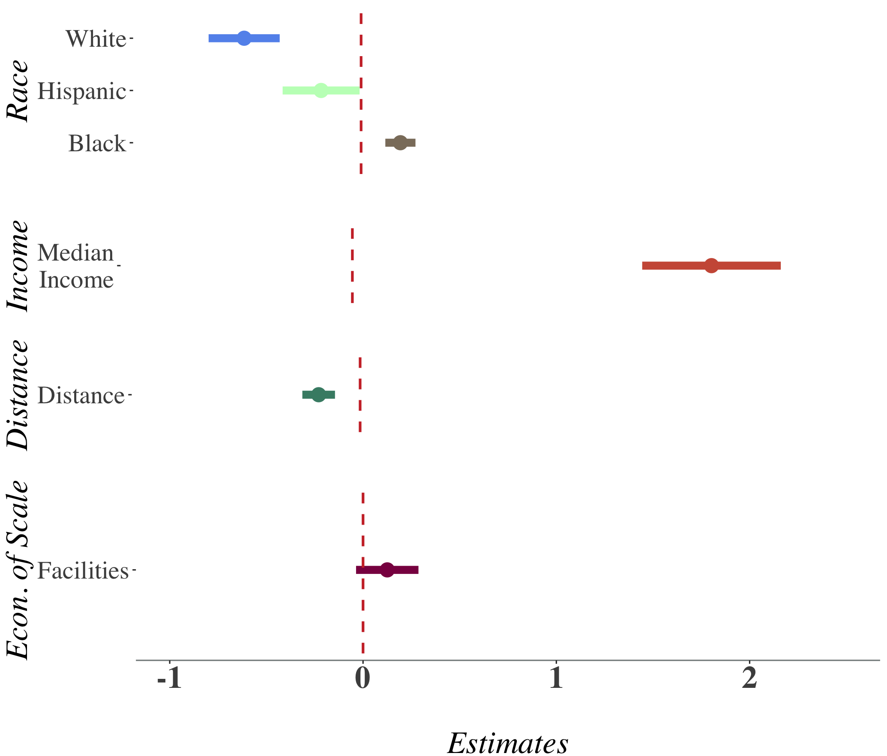]
]
.center[Fig.11 **Gravity Model Estimates at Census Block level**]
---


## Results after the GS Policy

.pull-center[
.center[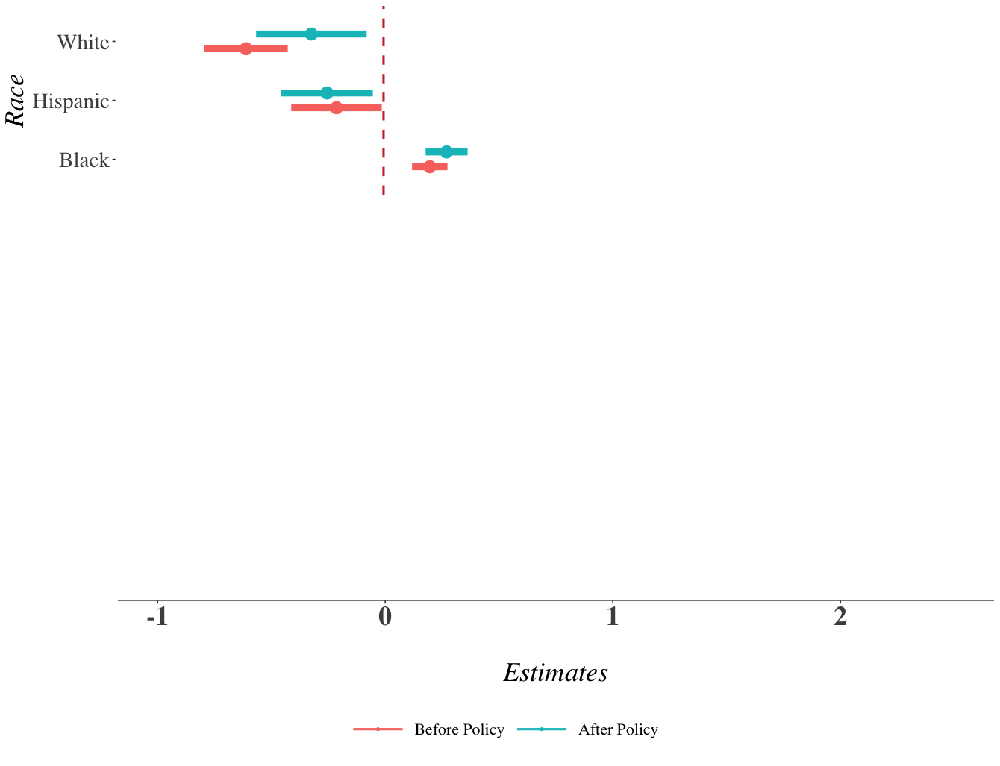]]
.center[Fig.12 **Gravity Model Estimates at Census Block level**]

---

## Results after the GS Policy 

.pull-center[
.center[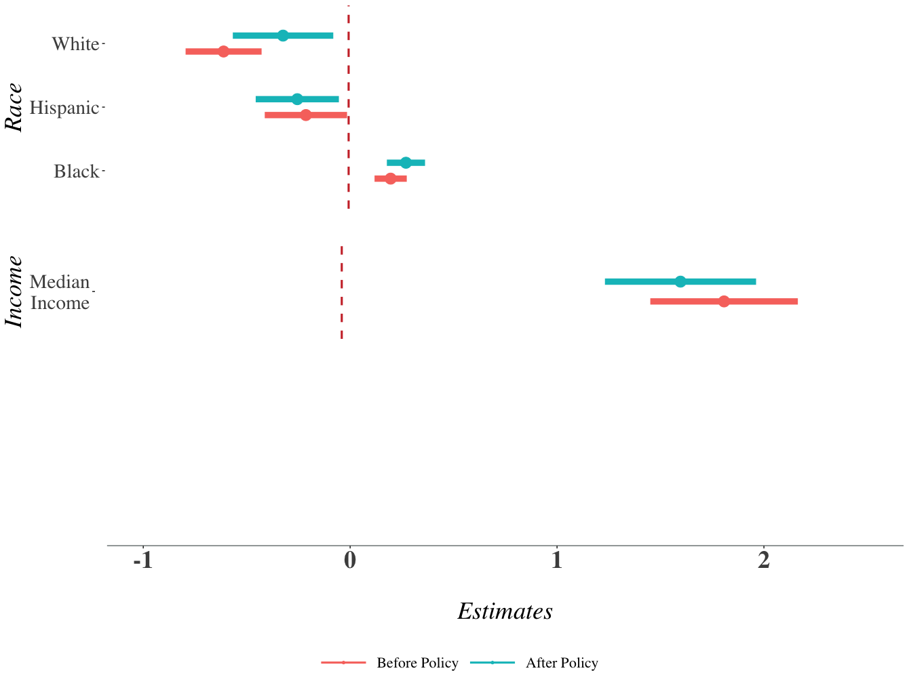]]
.center[Fig.12 **Gravity Model Estimates at Census Block level**]

---

## Results after the GS Policy 

.pull-center[
.center[]]
.center[Fig.12 **Gravity Model Estimates at Census Block level**]
---

## Results after the GS Policy 

.pull-center[
.center[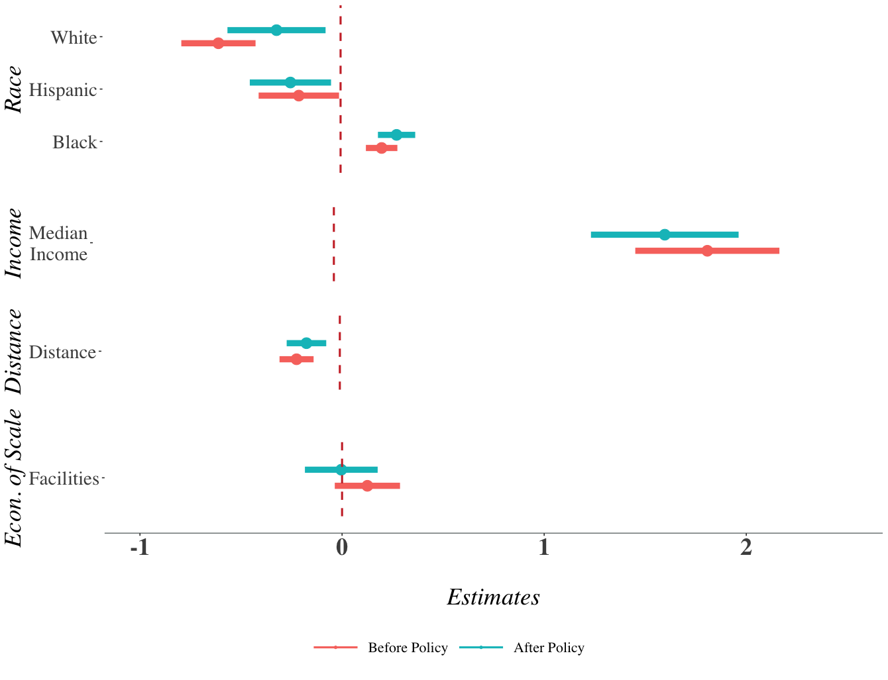]]
.center[Fig.12 **Gravity Model Estimates at Census Block level**]
---


## Preliminary Results

**California Pollution Relocation** 

- Before China's GS policy
  
  - Waste tend to relocate to <span style="color:darkgreen">**minority communities**</span>

--

- After China's GS policy
  
 - Inflows increased more for <span style="color:darkgreen">** lower-income white communities**</span>
 
--

- Counterintuitive?
    
---


## Mechanism -- Political Costs

- Racial composition of the destination community is highly correlated with political votes

.center[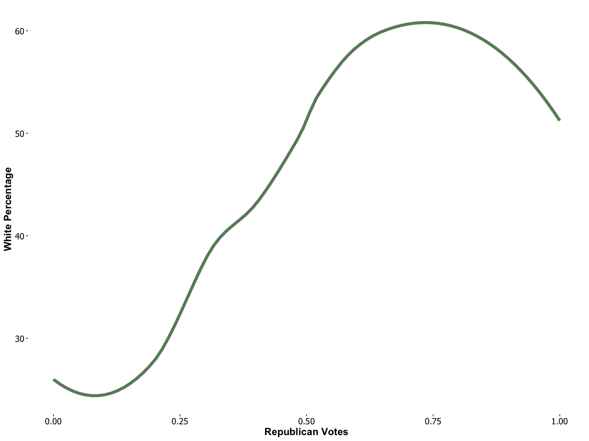]

.center[Fig.13 **Correlation between White percentage by blocks and Republican votes by precinct**]

--

- Higher Republican votes, higher percentage of White population in the community

--

- Does disposal flow increase more in Republican communities due to political costs?
<br/>


---


## Theory
<font size="3"> 
- Pollution relocation depends on **transportation costs** and **political costs**
$$Y_{ij} = \frac{\overline Y_{i}}{C_{ij}(d_{ij}\cdot f_{ij})\cdot P_{ij}(V{jc})}$$
 - $Y_{ij}$ is pollution relocated from jurisdiction $i$ to facility $j$
 - $\overline Y_{i}$ is the waste pollution generated by jurisdiction $i$
 - $C_{ij}(d_{ij}\cdot f_{ij})$ is a transportation cost function w.r.t distance (overseas/domestic) and fuel price per mile
 - $P_{ij}(V{jc})$ is a political cost function w.r.t. votes in district where facility $j$ located

--

- Political costs depend on the distance between precinct(destination) votes and state-incumbent votes
$$V{jc} = v_{j} - \overline v_{c}$$
 - $v_{j}$ is the votes of the district
 - $v_{c}$ is California's incumbent votes
 - $V_{jc}$ is the political cost of the destination community

--


.pull-left[- Before China's policy shock
 - $C_{ij}(d_{ij}\cdot f_{ij})$ << $P_{ij}(V{jc})$
 - Political costs prevail
 ]

 
.pull-right[- After China's policy shock
 - $C_{ij}(d_{ij}))$ >> $P_{ij}(V{jc})$
 - Marginal political costs deminished
 ]
 

---


## Theory


.pull-center[

]


- China's GS policy shock shifts the curve flatter (less elastic)
---


## Theory

.pull-center[
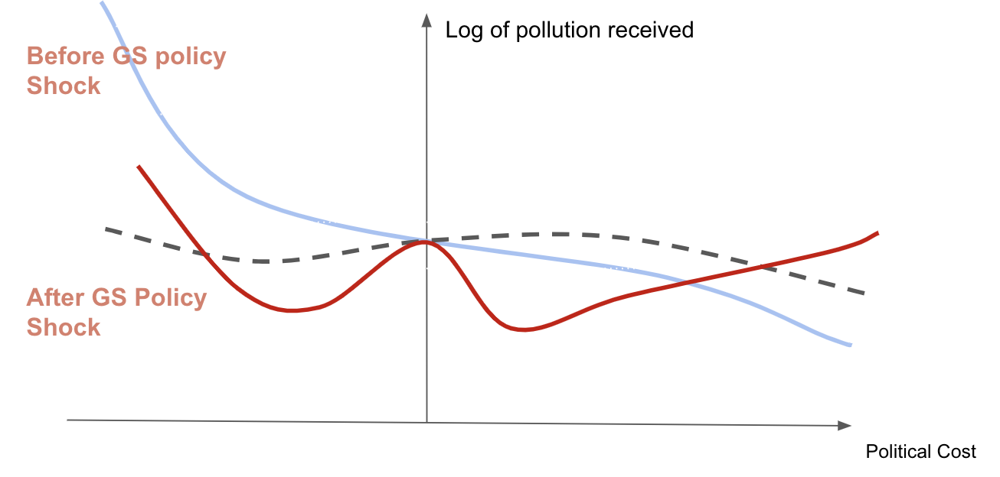
]

- Excessive pollution relocation shifted from "very" republican communities to "very" democratic communities

- Swing communities remain high political costs
---


## California Voting by Precinct
.pull-center[
.center[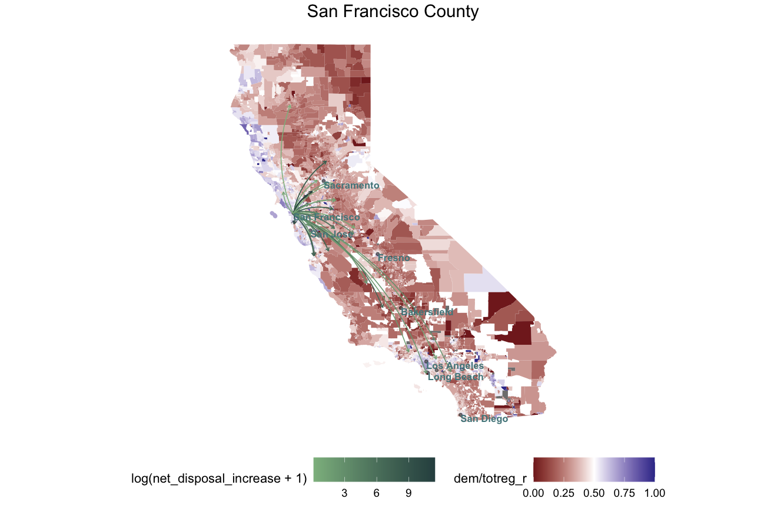]]
.center[Fig.14 **Disposal flow and Voting by precinct in California**]

---


## Voting variation

.pull-left[

]
.pull-right[

]
.center[Fig.15 **Voting variation within the county**]
---


## Mechanism -- Political Costs
.pull-left[
.center[**Before China's GS Policy**]
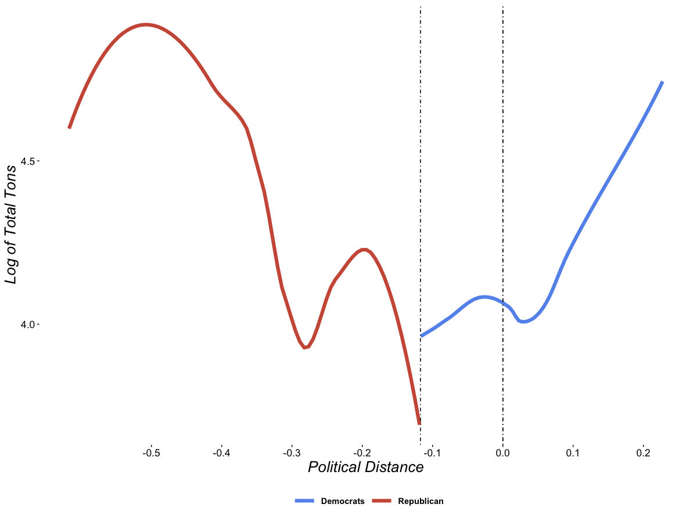
- Facilities in Republican communities (low political costs) received more waste pollution
]


---


## Mechanism -- Political Costs


.pull-left[
.center[**Before China's GS Policy**]

- Facilities in Republican communities (low political costs) received more waste pollution
]


.pull-right[
.center[**After China's GS Policy**]
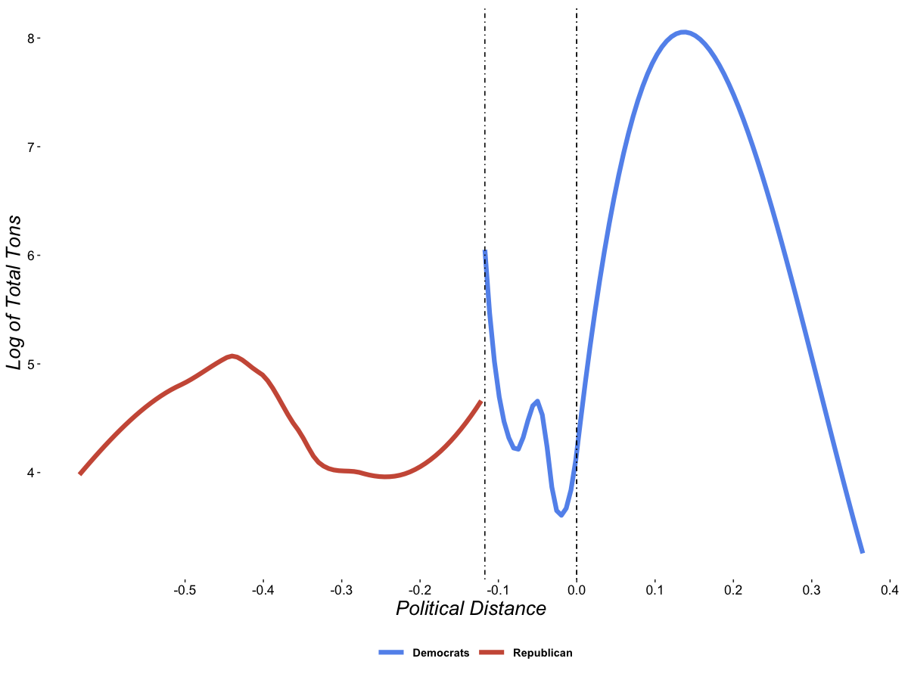
- Facilities from democratic communities (relatively higher political costs) received more waste pollution
]

---


## Regression Result

**OLS Regression**
$$log(Y_{ijt}) = \alpha + \beta_{1} P_{j}(Vjc) + \beta_{2} GS_{post} * P_{j}(Vjc) + \beta_{3}log(X_{jt})$$
$$\epsilon_{o} + \theta_{d} + \mu_{od} + \eta_{t} + \lambda_{odt}$$

```{r table2, echo=FALSE, message=FALSE, warnings=FALSE, results='asis'}
tabl <- "
|                         | Overall            | Republican   | Democrats  |
|---------------          |:-------------:     |------:       |------:     |
| Political Cost j        | -0.144             |   -1.2584    |0.59845     |
|                         |(0.062)             | (0.101)      |(0.439)     |
| Post * Political Cost j | 0.726              |  1.113408    | -3.32037   |
|                         |(0.109)             | (0.171)      |(0.605)     |
|Controls                 | Y                  |  Y           | Y          |
|County d FE              | Y                  |  Y           | Y          |
|Year FE                  | Y                  |  Y           | Y          |
|Quarter FE               | Y                  |  Y           | Y          |
|Two-way clustered SD     | Y                  |  Y           | Y          |
"
cat(tabl) # output the table in a format good for HTML/PDF/docx conversion
```

---

## Conclusion Preliminary Findings

- **U.S. State-level Methane Emissions**

  - Many states show <span style="color:darkgreen">statistically significant increases</span> in methane emission
  
  - Relate to <span style="color:darkgreen">historical trade volume</span>, <span style="color:darkgreen">stringency of envir. regulations</span>

--

- **California Pollution Relocation** 

  - Before China's GS policy
  
   Waste tend to relocate to <span style="color:darkgreen">**minority communities**</span>

--

  - After China's GS policy
  
    Inflows increased more for <span style="color:darkgreen">**white communities**</span>
    
--
   
   - Potential mechanism 
   
   Waste tended to relocate to places that have <span style="color:darkgreen">**lower political costs**</span>. After GS policy shock, pollution relocated more to higher political costs places
   
---

## Appendix: Landfills and PM25


---


## Appendix: The effect of GS policy on State-level Methane Emissions 

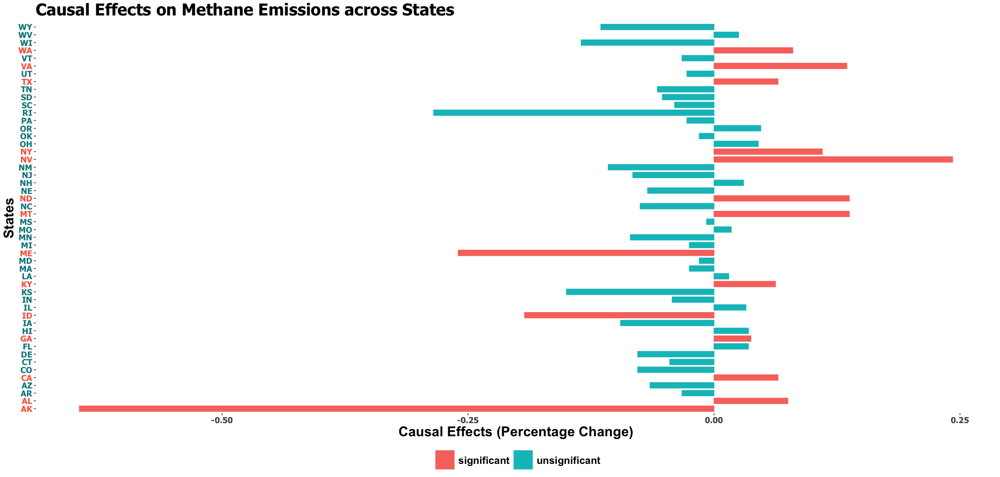

---


## Appendix: Economies of Scale or Vertical Integration


.pull-left[

]

.pull-right[

]
.center[**Data Source: CalRecycle and Waste Business Journal (WBJ)**]
---


## Appendix: Economies of Scale or Vertical Integration

- Other facilities within <span style="color:darkgreen">**15km Buffer**</span> of the destination facility
.pull-left[

]

.pull-right[

]
.center[**Data Source : CalRecycle and WBJ**]
---


## Future Work Plan

- Control for <span style="color:darkgreen">**California's wild fires**</span>, which could be a noise in my estimates for GS policy.

--

- In addition to racial composition of the community, examine the relationship between <span style="color:darkgreen">**industry vertical integration (economies of scale)**</span> of the community and pollution relocation.

--

- Empirically evaluate if there is <span style="color:darkgreen">**environmental gentrification**</span> happening in the past four decades because of the pollution (waste) relocation.
